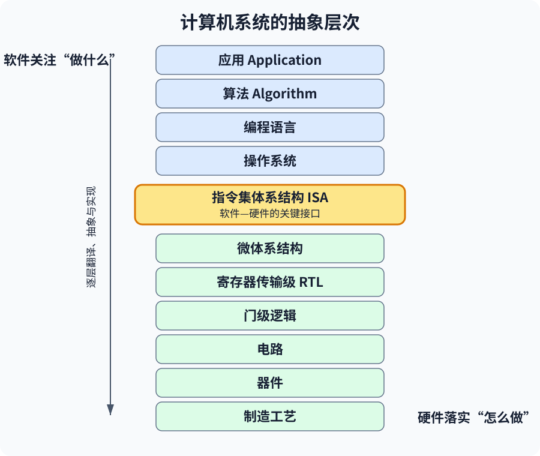
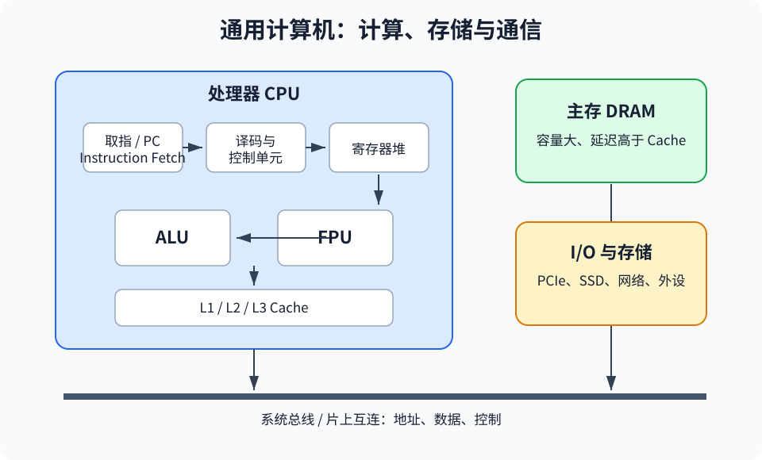
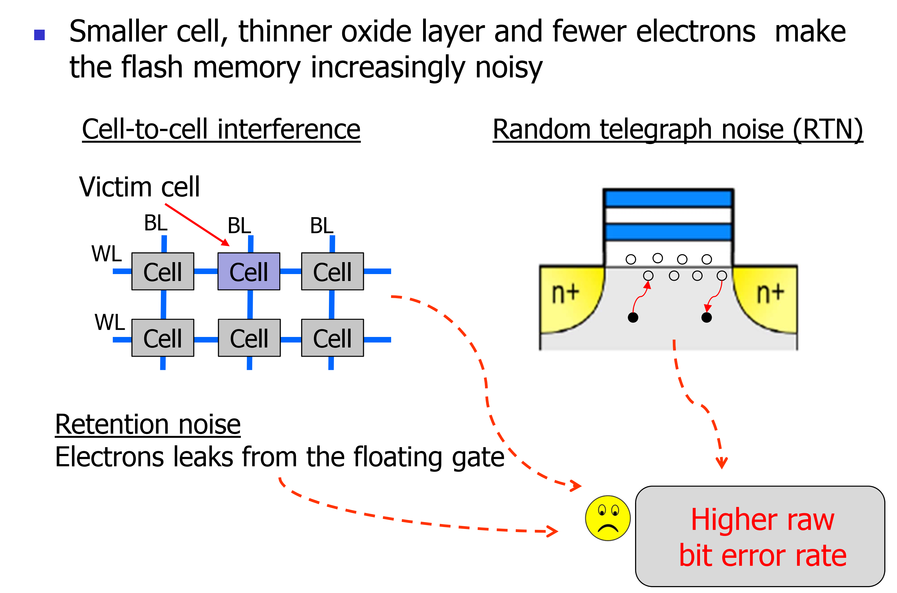
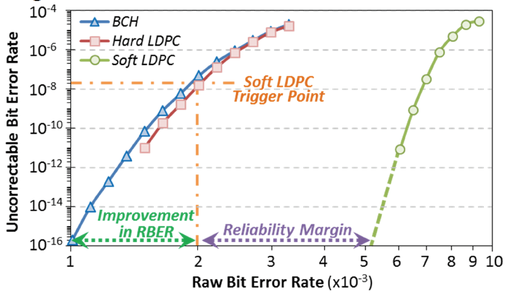

# 第 1 讲：计算机体系结构概览

> 对应课件：`1-Overview-2026-教学网.pptx`。本笔记保留课程涉及的技术内容，省略教师简介、招生宣传、评分、截止日期、课堂纪律、联系方式、装饰图片和重复过渡页。

## 1. 课程知识地图

计算机体系结构关注硬件与软件的接口，以及如何在给定工艺、成本、功耗和可靠性约束下高效执行程序。课程的主要技术范围包括：

- 处理器数据通路与控制：流水线、超标量、乱序执行。
- 存储层次：缓存、主存、I/O、互连、非易失存储和 SSD。
- 并行体系结构：多核、多处理器、GPU 和领域专用架构（DSA）。
- 横向问题：性能、能耗、散热、可靠性、安全和新兴器件。
- 研究方法：借助模拟器进行定量分析，比较基线设计与候选方案。

两类经典教材的侧重点不同：P&H 偏基础，主要讲计算机抽象、指令、算术、处理器、存储和多核；H&P 偏高级定量分析，重点包括存储层次、指令级并行、数据级并行和线程级并行。

## 2. 什么是计算机体系结构

应用需求与底层工艺之间存在很大的语义鸿沟。计算机体系结构通过一系列抽象层和实现层，把“应用想完成什么”逐步转换为“器件如何工作”，目标是利用可用制造技术高效完成信息处理。

典型计算机系统栈自上而下为：

1. 应用（Application）
2. 算法（Algorithm）
3. 编程语言（Programming Language）
4. 操作系统（Operating System）
5. 指令集体系结构（ISA）
6. 微体系结构（Microarchitecture）
7. 寄存器传输级（RTL）
8. 门级逻辑（Gate Level）
9. 电路（Circuits）
10. 器件（Devices）
11. 制造工艺（Technology）

*图：ISA 位于软件与硬件的交界处；向上提供稳定抽象，向下允许不同实现。*

以数组排序为例：应用提出“把数组排好序”；算法可采用选择排序；高级语言把算法写成程序；编译器把程序转换为 ISA 指令；微体系结构负责取指、译码和执行；再向下落实为 RTL、逻辑门、电路、晶体管与硅工艺。

几个关键层次的职责：

- 操作系统管理底层硬件资源，例如进程、内存和 I/O。
- ISA 规定机器可执行的指令，是软件与硬件之间的关键接口。
- 微体系结构决定指令在具体处理器内部如何实现和如何流动。
- 门级、电路级和器件级最终把逻辑功能落实到晶体管与连线。

## 3. 数字系统和通用计算机的基本构件

数字系统由三类基本构件组成：

- 逻辑（Logic）：处理数据。
- 状态（State）：保存数据。
- 互连（Interconnect）：在部件之间搬运数据。

在更高层次，通用计算机又可以概括为：

- 处理器：负责计算。
- 存储器：负责保存信息。
- 网络或互连：负责通信。

程序的输入数据经网络或 I/O 进入系统，由处理器计算，中间状态存放在寄存器、缓存和内存中，最后形成输出。

## 4. 体系结构研究的科学方法

系统研究与一般科学研究具有相似流程：

1. 建立并建模基线系统。
2. 针对系统提出问题。
3. 构造假设或候选设计。
4. 设计实验并测量。
5. 分析结果并得出结论。
6. 建立替代系统，继续探索设计空间。

区别在于：自然科学侧重发现自然规律，计算机工程侧重在约束下探索和选择更好的系统设计。

## 5. 主板、总线与处理器内部结构

### 5.1 主板主要部件

传统主板包含 CPU 插槽、内存插槽、北桥、南桥、PCI/PCIe 插槽、USB 接口，以及 PATA/SATA 等存储接口。

- CPU 有多种物理插槽标准，但比插槽更重要的是 ISA 兼容性。
- PC 体系长期保持 x86 兼容；现代桌面和服务器的主流 ISA 是 AMD 推动形成的 x86-64，Intel、AMD 等可实现兼容处理器。
- 北桥传统上协调 CPU 对主存的访问。主存从 DRAM 演进到 SDRAM，再到 DDR SDRAM。
- 南桥连接相对低速的 I/O 总线和设备。PCI、AGP、PCI-X 等接口负责设备、CPU 与主存之间的数据交换。
- 存储接口从 PATA/IDE、ATAPI 演进到 SATA，也存在 SCSI 等标准。

多个设备共享系统总线和主存时，会竞争带宽；缓存和专用互连用于缓解这一问题。

### 5.2 处理器内部

典型处理器内部包含：

- PC 与取指单元：从指令存储器取指。
- 译码与控制单元：解释指令并发出控制信号。
- 寄存器：保存操作数和结果。
- ALU：执行整数算术和逻辑运算。
- FPU：执行浮点运算。
- L1/L2/L3 缓存：缓解处理器与主存之间的速度差距。

数据在主存、缓存、寄存器与执行单元之间流动；控制单元决定每个周期由哪些部件工作以及数据走哪条路径。

*图：CPU 通过缓存和系统互连访问主存及 I/O；多个部件共享互连时会产生带宽竞争。*

## 6. 技术进步、性能墙与体系结构方法

历史数据表明，处理器相对性能曾从早期工作站的约 `1.2` 上升到 Pentium 4/Xeon 时代的约 `3000`，提升了几个数量级。课件给出的典型历史趋势包括：

- DRAM：容量约每 2 年翻倍，速度约每 10 年提高 1.5 倍，每比特成本约每年下降 25%。
- 磁盘：容量曾以约每年 60% 的速度增长。
- 处理器：性能曾以约每年 30% 的速度增长，晶体管容量约每 1.5 年翻倍。

但容量、延迟和带宽并不同步增长，形成“处理器—存储器鸿沟”。仅靠提高时钟频率也不可持续：随着频率和集成度上升，功率密度从早期处理器水平逐渐逼近热板、核反应堆乃至火箭喷口所对应的数量级；芯片热点温度可达到约 `120°C`。因此性能提升必须更多依赖体系结构，而不能只依赖频率。

同频或近似同频下提高性能的典型方向：

- 改进指令调度，让更多指令并行执行。
- 扩大并优化缓存层次，减少等待主存的时间。
- 使用多核、专用加速器和异构计算。
- 优化互连、内存和存储系统。

## 7. 多核系统带来的问题

多核不是简单地把多个核放在一起，还要解决：

- 核之间如何互连。
- 多核共享缓存时如何保证一致性（consistency）与缓存一致性协议意义上的连贯性（coherence）。
- 线程如何在多个核之间调度和同步。
- 调度时是否考虑缓存亲和性，减少迁移导致的缓存失效。
- 多核共享 DRAM 时如何处理大内存占用与带宽争用。
- 如何让共享存储与 PCIe/I/O 的性能跟上计算能力。

## 8. 数据中心能耗与散热

2010—2018 年间，数据中心计算实例数量约增加 `550%`，但用电量仅增加约 `6%`，说明能效提升抵消了相当一部分规模增长。相关手段包括：

- 晶体管工艺改进。
- GPU、FPGA、领域加速器与异构计算。
- 新型存储器件。
- 虚拟化，提高资源利用率。
- 更高效的冷却和热管理。

大型数据中心通常具有更好的 PUE；在合适条件下，把计算集中到云端可能比低利用率的本地服务器或小型机房更节能。

## 9. 可靠性：以 NAND Flash/SSD 为例

NAND Flash 的成本持续下降，应用从消费设备扩展到客户端和企业级系统。但工艺缩小带来新的可靠性问题：单元更小、氧化层更薄、存储电子更少，使阈值电压更容易受噪声影响。

主要噪声来源包括：

- 单元间干扰（cell-to-cell interference）。
- 随机电报噪声（RTN）。
- 保持噪声：电子从浮栅泄漏，数据保存时间越长，错误可能越多。
- 擦写（P/E）循环造成磨损；擦写次数与保持时间增加时，原始比特错误率（RBER）上升。

*图：单元间干扰、随机电报噪声和电荷保持损失都会提高原始比特错误率。*

读阈值电压优化可以降低 RBER。纠错码（ECC）则把一定范围内的原始错误纠正回来：

- BCH 是传统硬判决纠错方案。
- LDPC 可采用硬判决或软判决；软判决 LDPC 能容忍更高的原始错误率，但代价通常是更多读取、计算和延迟。
- 系统可在 RBER 达到阈值时触发更强的软判决解码，从而扩大可靠性余量。

*图：BCH、硬判决 LDPC 和软判决 LDPC 能处理的 RBER 不同；更强纠错扩大了可靠性余量。*

因此，SSD 可靠性不是只靠介质本身，而是器件、读阈值管理、控制器算法和 ECC 的共同结果。
