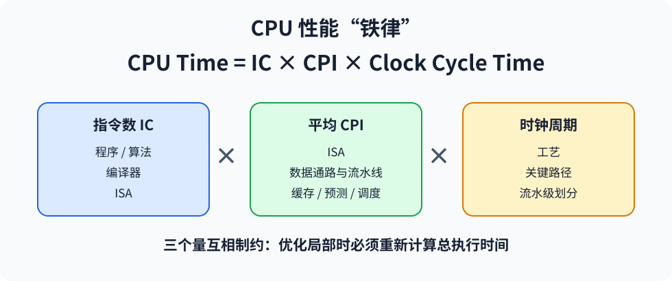
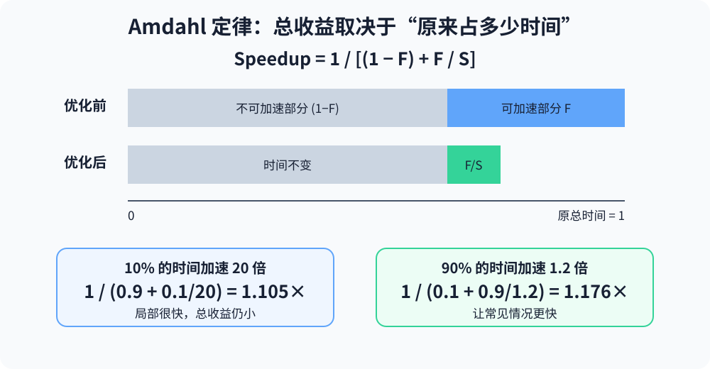
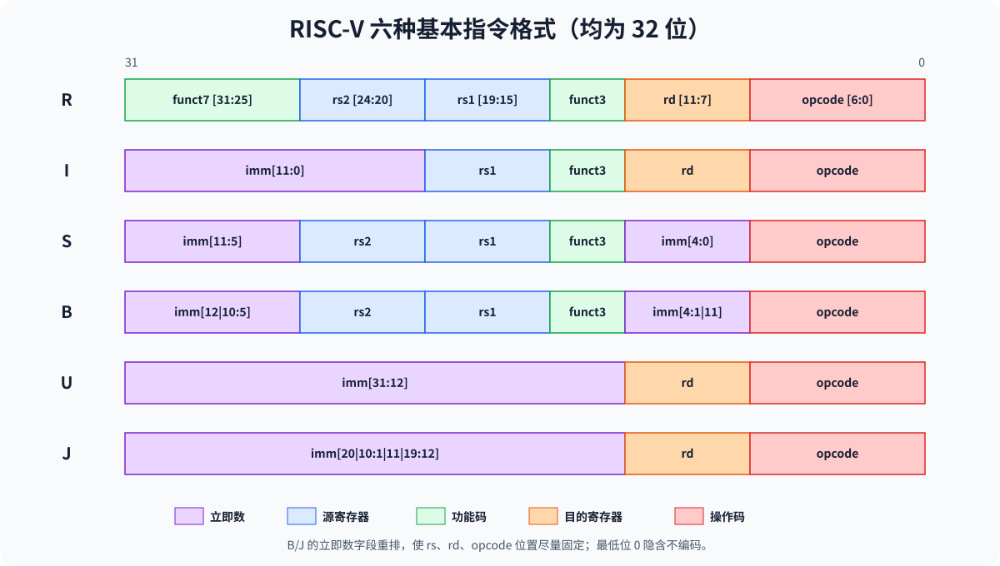
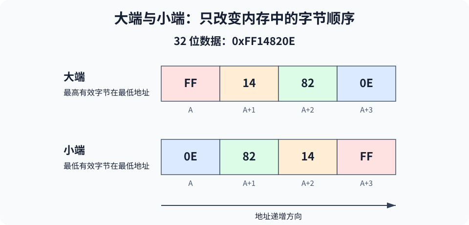

# 第 2 讲：性能与 RISC-V ISA

> 对应课件：`2-RISC-V-Performance-ISA-2026-教学网.pptx`。已去除封面、重复过渡、图片来源和课堂闲话；公式、例题、指令格式、调用约定与同步语义均予保留。课件中少量明显的 opcode/格式笔误已按 RISC-V 规范修正。

## 1. 为什么需要性能指标

从购买者角度，要比较哪台机器性能最好、成本最低、性价比最高；从设计者角度，要比较哪种设计改进提升最大、成本最低、性价比最高。两者都需要统一的比较基准和评价指标。

体系结构分析的目标不是只看某一个数字，而是理解 ISA、编译器、微体系结构和工艺如何共同决定总体性能，以及每项优化的收益与成本。

## 2. 延迟、吞吐率和性能

- 响应时间/执行时间/延迟（latency）：从任务开始到任务完成所需的时间，个人用户通常更关心它。
- 吞吐率（throughput）：单位时间完成的任务总量，数据中心更关心它。
- 性能与执行时间成反比：

\[
Performance = \frac{1}{Execution\ Time}
\]

若机器 X 比 Y 快 `n` 倍：

\[
n = \frac{Performance_X}{Performance_Y}
  = \frac{Execution\ Time_Y}{Execution\ Time_X}
\]

降低单个任务的响应时间通常也会改善吞吐率，但二者并不等价。例如汽车流水线制造一辆车需 6 小时，延迟是 6 小时/辆；由于多辆车重叠生产，每 5 分钟可下线一辆，吞吐率为 12 辆/小时，所以可有 `Throughput > 1/Latency`。

## 3. 时钟、CPI、IPC 与 CPU 性能方程

### 3.1 时钟频率与周期

\[
Clock\ Cycle\ Time = \frac{1}{Clock\ Rate}
\]

换算示例：10 ns→100 MHz，5 ns→200 MHz，2 ns→500 MHz，1 ns→1 GHz，500 ps→2 GHz，250 ps→4 GHz，200 ps→5 GHz。

### 3.2 CPI 和有效 CPI

CPI（Cycles Per Instruction）是每条指令平均需要的时钟周期数。不同指令类别可能具有不同 CPI，因此程序的有效 CPI 取决于动态指令混合：

\[
CPI_{effective} = \frac{\sum_i IC_i\cdot CPI_i}{\sum_i IC_i}
= \sum_i Frequency_i\cdot CPI_i
\]

其中 `IC_i` 是第 `i` 类指令的动态条数，`Frequency_i` 是其动态比例。

### 3.3 “铁律”

\[
CPU\ Time = CPU\ Clock\ Cycles\times Clock\ Cycle\ Time
\]

\[
CPU\ Time = IC\times CPI\times Clock\ Cycle\ Time
= \frac{IC\times CPI}{Clock\ Rate}
\]

- `IC` 受 ISA、程序和编译器影响。
- `CPI` 受 ISA 和处理器组织影响。
- 时钟周期受工艺与处理器组织影响。
- 三个量往往互相牵制，不能只优化其中一个。



*图：IC、CPI 与时钟周期分别受不同层次影响，局部优化可能改变另外两个量。*

IPC（Instructions Per Cycle）在简单平均意义下常近似为 `1/CPI`。若同一程序在两个处理器上的指令数和频率相同，可以直接比较 CPI 或 IPC。

例：程序执行 330 亿条指令，平均 CPI=2，时钟频率 3 GHz：

\[
CPU\ Time=\frac{33\times10^9\times2}{3\times10^9}=22s
\]

## 4. 性能优化例题

某程序的动态指令构成为：

| 类别 | 比例 | CPI | 对总 CPI 的贡献 |
|---|---:|---:|---:|
| ALU | 50% | 1 | 0.5 |
| Load | 20% | 5 | 1.0 |
| Store | 10% | 3 | 0.3 |
| Branch | 20% | 2 | 0.4 |

原有效 CPI 为 `2.2`。

- 若改进数据缓存，使 Load 的 CPI 从 5 降到 2：新 CPI=`1.6`，加速比 `2.2/1.6=1.375`，即快 37.5%。
- 若分支预测使 Branch 少 1 个周期：新 CPI=`2.0`，加速比 `1.1`，即快 10%。
- 若两条 ALU 指令可同时执行，相当于 ALU 部分平均贡献降为 0.25：新 CPI=`1.95`，加速比约 `1.128`，即快 12.8%。

结论：应根据某部分占总执行时间的比例判断优化价值，而不是只看该部件自身能加速多少。

## 5. 如何汇总多程序性能

### 5.1 算术平均、加权平均和几何平均

- 执行时间的算术平均会让运行时间长的程序占更大权重。
- 加权算术平均可以强调重要程序，但权重选择会影响结论。
- 对归一化执行时间或加速比，不能简单使用算术平均；常使用几何平均：

\[
GM=(\prod_{i=1}^{N}x_i)^{1/N}
\]

几何平均对参考机的选择具有一致性。

### 5.2 平均 CPI 与平均 IPC

不能先把 IPC 做算术平均，再把结果当作平均 CPI 的倒数。若各测试负载权重相同：

\[
Average\ CPI=\frac{CPI_1+CPI_2+\cdots+CPI_N}{N}
\]

因此与运行时间一致的平均 IPC 是 IPC 的调和平均：

\[
Average\ IPC=\frac{1}{Average\ CPI}
=\frac{N}{\frac1{IPC_1}+\frac1{IPC_2}+\cdots+\frac1{IPC_N}}
\]

## 6. Amdahl 定律

设可加速部分占原执行时间比例为 `F`，该部分自身加速 `S` 倍：

\[
T_{new}=T_{old}\left((1-F)+\frac{F}{S}\right)
\]

\[
Speedup_{overall}=\frac{1}{(1-F)+F/S}
\]

注意 `F` 是原执行时间中可受益部分的比例，而不是代码行数、距离或指令数的比例。



*图：不可加速部分保持不变并逐渐成为瓶颈；覆盖范围通常比局部加速倍数更重要。*

例：

- 只占 10% 时间的部分加速 20 倍：总加速比 `1/(0.9+0.1/20)=1.105`。
- 占 90% 时间的部分只加速 1.2 倍：总加速比 `1/(0.1+0.9/1.2)=1.176`，反而更好。
- 汽车行程中高速路 50 km、城市拥堵路段 10 km。高速路速度从 100 km/h 提升到 200 km/h，城市仍为 5 km/h：总时间从 2.5 h 降到 2.25 h，只减少 10%，总加速比约 1.111。

基本原则：让常见情况更快（make the common case fast）。局部性意味着程序约 90% 的时间可能花在约 10% 的代码上，应优先优化热点。

还存在收益递减：若第一代系统中某阶段占一半时间并加速 2 倍，总加速为 1.33；优化后该阶段只占新系统的 1/3，再次把它加速 2 倍，下一代相对上一代仅加速 1.2 倍。

设计还必须考虑成本、开发验证开销、售价、市场需求和销量；“技术上更快”不一定意味着“产品上更优”。

## 7. ISA 的评价与作用

### 7.1 评价 ISA

- 设计期：能否实现、实现需要多久、成本多高、是否容易编程和编译。
- 静态指标：程序代码占多少字节。
- 动态指标：执行多少条指令、取回多少指令字节、每条指令需要多少周期、可实现多短的时钟周期。
- 最终指标：真实程序的执行时间，它同时取决于 ISA、处理器组织和编译技术。

### 7.2 ISA 所处层次

抽象层次从上到下为：应用软件→操作系统→ISA→微体系结构→逻辑→数字电路→模拟电路→器件与工艺→物理。

ISA 是软硬件之间的关键抽象：

- 对软件：规定如何编程、有哪些指令、寄存器和可见状态。
- 对硬件：规定必须实现什么，但不限定具体流水线、乱序方式或电路实现。
- 编译器把高级语言转换为汇编/机器码；处理器按 PC 指向的顺序取回机器指令并执行。

好的抽象应跨越多代实现、用途广、向上提供方便功能、向下允许高效实现。体系结构与实现分离有利于保持统一、简单和概念完整性。

## 8. CISC、RISC 与 RISC-V

### 8.1 CISC 与 RISC

早期内存昂贵、容量小，程序员大量直接写汇编，因此 CISC 倾向于使用复杂、紧凑、长度可变的指令，让一条指令完成更多工作；代价是译码、编译和控制状态机复杂。

RISC 的典型理念：

- 固定指令长度。
- Load/Store 架构：只有加载和存储访问内存。
- 较少的寻址方式。
- 较少且规则的操作。
- 复杂操作分解为多条简单指令。

现代 x86 处理器常把 x86 指令翻译为内部 RISC 风格微操作，再使用流水线、乱序等 RISC 技术。课件指出当代绝大多数处理器内核按广义 RISC 思路实现；移动与 SoC 时代还同时重视面积、能耗和性能。

### 8.2 RISC-V 的目标

RISC-V 起源于 UC Berkeley，发音为 “risk-five”。它是一套开放 ISA 标准，允许任何个人或组织构造兼容硬件和软件。

设计目标：

- 对学术界和工业界完全开放。
- 不为某一种微体系结构或实现技术过度设计，可高效实现于顺序、乱序、微码、ASIC、FPGA 等平台。
- 提供小而可独立使用的整数基础 ISA。
- 通过标准扩展支持通用软件，也允许自定义扩展。
- 支持 IEEE 754-2008 浮点标准。

RISC-V 规范拆分为用户级、压缩指令、特权级等部分。命名形式为 `RV + XLEN + 扩展`，例如 `RV32I` 表示 32 位基础整数 ISA。

常见扩展：

- `I`：基础整数、ALU、分支/跳转、Load/Store。
- `M`：整数乘除。
- `A`：原子指令。
- `F`：单精度浮点。
- `D`：双精度浮点。
- `C`：16 位压缩指令。
- `G = IMAFD`。

## 9. RISC-V 状态与六种基本指令格式

处理器含 PC、32 个整数寄存器 `x0`～`x31`、ALU/FPU、控制单元和内存接口。指令由 opcode 与操作数说明字段组成，基本指令均为 32 位。

| 格式 | 位段（高位→低位） | 典型用途 |
|---|---|---|
| R | `funct7[31:25] rs2[24:20] rs1[19:15] funct3[14:12] rd[11:7] opcode[6:0]` | 寄存器算术/逻辑 |
| I | `imm[11:0] rs1 funct3 rd opcode` | Load、立即数运算、`jalr` |
| S | `imm[11:5] rs2 rs1 funct3 imm[4:0] opcode` | Store |
| B/SB | `imm[12|10:5] rs2 rs1 funct3 imm[4:1|11] opcode` | 条件分支 |
| U | `imm[31:12] rd opcode` | `lui` 等 |
| J/UJ | `imm[20|10:1|11|19:12] rd opcode` | `jal` |

B/J 立即数字段看似“乱序”，是为了让 opcode、`rs1`、`rs2`、`rd` 等字段在各格式中尽量固定，同时复用硬件布线。分支/跳转目标按至少 2 字节对齐，最低位无需编码；最高立即数位是符号位。



*图：相同类型字段尽量保持固定位置；B、J 型只重排立即数位。*

## 10. 算术指令与寄存器

RISC-V 算术指令每条执行一个操作，32 位指令中显式给出 3 个操作数，顺序固定为“目的、源 1、源 2”：

```asm
add x5, x6, x7   # x5 = x6 + x7
sub x5, x6, x7   # x5 = x6 - x7
```

### 10.1 ABI 寄存器约定

| 寄存器 | ABI 名 | 用途 | 调用时由谁负责保存 |
|---|---|---|---|
| x0 | zero | 常数 0 | 不适用 |
| x1 | ra | 返回地址 | caller |
| x2 | sp | 栈指针 | callee |
| x3 | gp | 全局指针 | 固定用途 |
| x4 | tp | 线程指针 | 固定用途 |
| x5～x7 | t0～t2 | 临时值 | caller |
| x8～x9 | s0/fp～s1 | 保存寄存器/帧指针 | callee |
| x10～x17 | a0～a7 | 参数与返回值 | caller |
| x18～x27 | s2～s11 | 保存寄存器 | callee |
| x28～x31 | t3～t6 | 临时值 | caller |

`sp` 指向当前栈顶；`fp/s0` 可作为当前栈帧的稳定基准；`gp` 辅助访问全局/静态区；`tp` 指向每线程数据。

课件以 RV64 为例，寄存器堆含 32 个 64 位寄存器，通常有两个读端口和一个写端口。寄存器比内存快、编码短、便于编译器调度；但寄存器数量和读写端口越多，面积和延迟越大，端口代价增长尤其快。

R 型 `add` 使用 `opcode + funct3 + funct7` 确定操作，`rs1/rs2` 指定源，`rd` 指定目的。术语中 `word=32 bit`，`doubleword=64 bit`。

## 11. 内存访问、字节序与立即数

### 11.1 Load/Store

```asm
ld x5, 24(x6)   # x5 = Memory[x6 + 24]
sd x5, 24(x6)   # Memory[x6 + 24] = x5
```

有效地址为 64 位基址寄存器加 12 位有符号偏移，偏移范围为 `-2048～2047` 字节。`ld` 用 I 格式，`sd` 用 S 格式。

### 11.2 大小端

大小端规定一个多字节对象的各字节如何放到连续地址：

- 大端：最高有效字节放在最低地址。
- 小端：最低有效字节放在最低地址。

课件按小端 RISC-V 讲解；网络字节序通常采用大端。



*图：数值本身不变，变化的是各字节映射到连续地址的顺序。*

### 11.3 字节加载/存储

```asm
lb x5, 40(x6)
sb x5, 40(x6)
```

- `lb` 读取一个字节放入目的寄存器低 8 位，并把 bit 7 符号扩展到整个 XLEN；`lbu` 则零扩展。
- `sb` 只把源寄存器低 8 位写入目标字节；源寄存器其余位被忽略，同一内存字中的其他字节不变。

### 11.4 立即数与大常数

小常数直接放在指令中：

```asm
addi sp, sp, 4
```

`lui rd, imm20` 把 20 位立即数放入位 `[31:12]`，低 12 位清零；RV64 中位 31 还会向高 32 位符号扩展。再用 `addi` 或合适的逻辑立即数指令补低位，例如课件示例用 `lui` 加 `ori` 形成较长常数。

## 12. 分支、跳转与过程调用

### 12.1 条件分支

```asm
beq rs1, rs2, L1
bne rs1, rs2, L1
```

目标地址采用 PC 相对寻址。B 型立即数最低位隐含为 0，因此以 2 字节为粒度，范围为 `-4096～4094` 字节；2 字节粒度用于兼容压缩指令。

### 12.2 过程调用与返回

```asm
jal  x1, ProcedureAddress  # x1 = PC+4，跳到过程入口
jalr x0, 0(x1)            # 返回，不保留新的链接地址
jal  x0, Label            # 无条件跳转
```

远距离、寄存器间接跳转可由 `lui` 构造高位地址，再用 `jalr` 完成。

过程调用需要处理参数、返回地址、调用者现场、局部变量和全局变量。若寄存器不够或发生递归，要把值溢出到内存栈。栈是 LIFO 结构，通常从高地址向低地址增长：push 先减小 `sp` 再存数据，pop 先取数据再增大 `sp`。课件用 4 字节演示；保存 RV64 的 64 位寄存器时通常按 8 字节调整，并遵守 ABI 对齐。

## 13. 原子同步：LR/SC

简单锁常用 `0` 表示空闲、`1` 表示占用。RISC-V 不必提供复杂的单条 compare-and-swap，而可用保留加载/条件存储实现原子更新：

```asm
lr.d x5, (x6)       # 读取 Memory[x6] 并建立 reservation
sc.d x7, x5, (x6)   # reservation 仍有效才写回；x7 给出成功/失败
```

语义要点：

- 若从 `lr.d` 到匹配的 `sc.d` 期间 reservation 对应位置被改变，`sc.d` 失败且不写内存。
- `sc.d` 的结果寄存器指示成功或失败；失败时软件通常重试整个 LR/SC 序列。
- SC 只有在 reservation 仍有效且 reservation set 覆盖待写字节时才可能成功。
- LR 与 SC 地址不匹配时不能依赖其成功。
- 无论 SC 成功还是失败，执行 SC 都会使当前 hart 的 reservation 失效，所以没有新 LR 的第二个 SC 不能沿用旧 reservation。
- 一个 hart 不能靠多次 LR 同时维护多组独立 reservation；应把匹配的 LR/SC 保持为受约束的短序列。

## 14. 指令速查与寻址方式

| 类别 | 指令示例 | 正确 opcode | 含义 |
|---|---|---|---|
| R 型算术 | `add x5,x6,x7` / `sub x5,x6,x7` | `0110011` | 寄存器加/减 |
| I 型算术 | `addi x5,x6,20` / `ori x5,x6,20` | `0010011` | 寄存器与立即数运算 |
| Load | `ld x5,40(x6)` / `lb ...` | `0000011` | 从内存读入寄存器 |
| Store | `sd x5,40(x6)` / `sb ...` | `0100011` | 从寄存器写入内存 |
| U 型 | `lui x5,0x12345` | `0110111` | 高 20 位立即数 |
| 条件分支 | `beq` / `bne` | `1100011` | 条件成立时 `PC += offset` |
| J 型 | `jal x1,imm` | `1101111` | 保存 `PC+4` 后跳转 |
| I 型跳转 | `jalr x0,0(x1)` | `1100111` | 寄存器间接跳转/返回 |

四种主要寻址方式：

- 寄存器寻址：操作数在寄存器中。
- 基址/位移寻址：地址=`寄存器 + 12 位有符号常数`。
- 立即数寻址：操作数常数在指令中。
- PC 相对寻址：目标地址=`PC + 有符号偏移`。

## 15. RISC-V 设计原则

- 简单有利于规则：固定 32 位指令，字段位置尽量固定。
- 好设计需要折中：六种格式在规则性与表达能力间权衡。
- 小而快：限制基础指令、寄存器数量和寻址方式。
- 让常见情况更快：算术操作数放寄存器中，采用 Load/Store 架构，并允许常见小常数直接编码为立即数。
