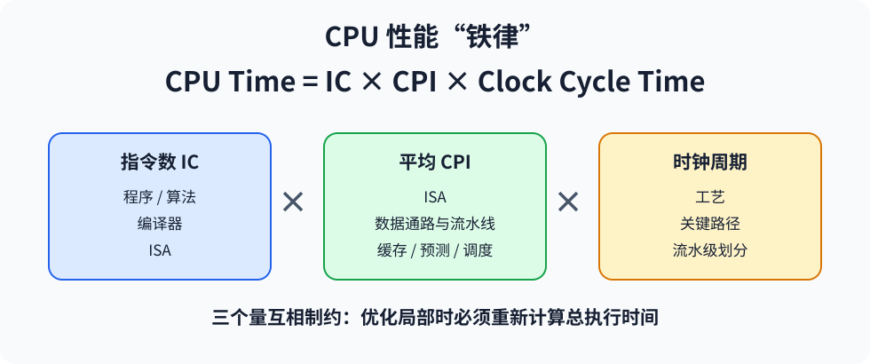
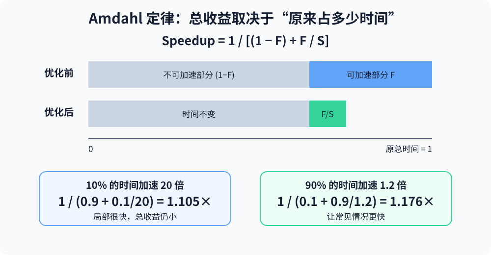
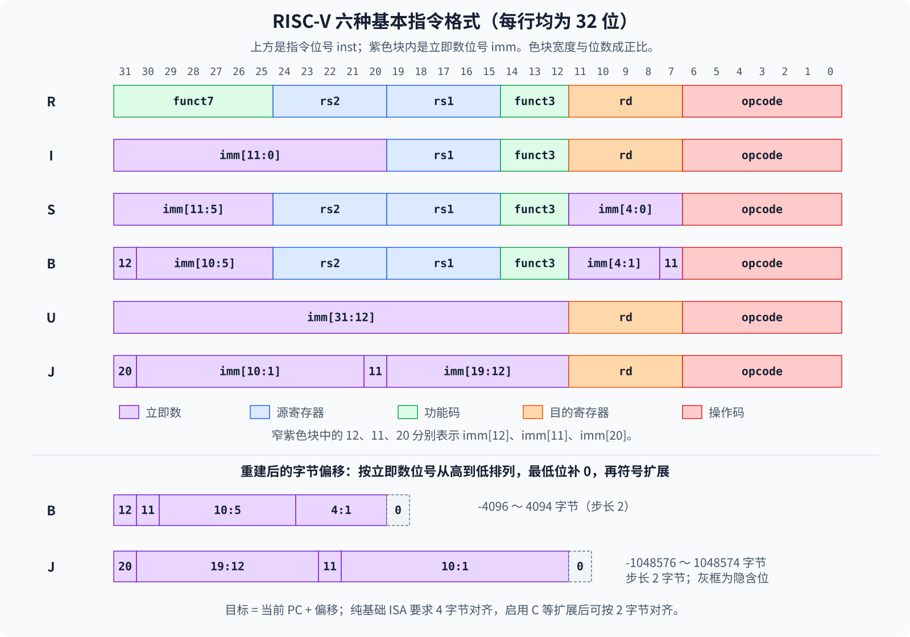
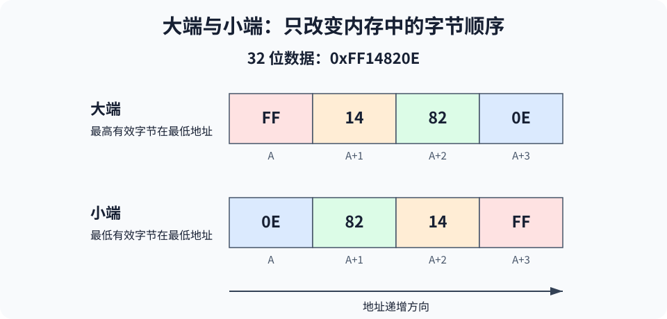

# 第 2 讲：性能与 RISC-V ISA

> 对应课件：`2-RISC-V-Performance-ISA-2026-教学网.pptx`。已去除封面、重复过渡、图片来源和课堂闲话；公式、例题、指令格式、调用约定与同步语义均予保留。课件中少量明显的 opcode/格式笔误已按 RISC-V 规范修正。

## 1. 为什么需要性能指标

从购买者角度，要比较哪台机器性能最好、成本最低、性价比最高；从设计者角度，要比较哪种设计改进提升最大、成本最低、性价比最高。两者都需要统一的比较基准和评价指标。

体系结构分析的目标不是只看某一个数字，而是理解 ISA、编译器、微体系结构和工艺如何共同决定总体性能，以及每项优化的收益与成本。

## 2. 延迟、吞吐率和性能

- 响应时间/执行时间/延迟（latency）：从任务开始到任务完成所需的时间，个人用户通常更关心它。
- 吞吐率（throughput）：单位时间完成的任务总量，数据中心更关心它。
- 性能与执行时间成反比：

\[
Performance = \frac{1}{Execution\ Time}
\]

若机器 X 比 Y 快 `n` 倍：

\[
n = \frac{Performance_X}{Performance_Y}
  = \frac{Execution\ Time_Y}{Execution\ Time_X}
\]

降低单个任务的响应时间通常也会改善吞吐率，但二者并不等价。例如汽车流水线制造一辆车需 6 小时，延迟是 6 小时/辆；由于多辆车重叠生产，每 5 分钟可下线一辆，吞吐率为 12 辆/小时，所以可有 `Throughput > 1/Latency`。

## 3. 时钟、CPI、IPC 与 CPU 性能方程

### 3.1 时钟频率与周期

\[
Clock\ Cycle\ Time = \frac{1}{Clock\ Rate}
\]

换算示例：10 ns→100 MHz，5 ns→200 MHz，2 ns→500 MHz，1 ns→1 GHz，500 ps→2 GHz，250 ps→4 GHz，200 ps→5 GHz。

### 3.2 CPI 和有效 CPI

CPI（Cycles Per Instruction）是每条指令平均需要的时钟周期数。不同指令类别可能具有不同 CPI，因此程序的有效 CPI 取决于动态指令混合：

\[
CPI_{effective} = \frac{\sum_i IC_i\cdot CPI_i}{\sum_i IC_i}
= \sum_i Frequency_i\cdot CPI_i
\]

其中 `IC_i` 是第 `i` 类指令的动态条数，`Frequency_i` 是其动态比例。

### 3.3 “铁律”

\[
CPU\ Time = CPU\ Clock\ Cycles\times Clock\ Cycle\ Time
\]

\[
CPU\ Time = IC\times CPI\times Clock\ Cycle\ Time
= \frac{IC\times CPI}{Clock\ Rate}
\]

- `IC` 受 ISA、程序和编译器影响。
- `CPI` 受 ISA 和处理器组织影响。
- 时钟周期受工艺与处理器组织影响。
- 三个量往往互相牵制，不能只优化其中一个。



*图：IC、CPI 与时钟周期分别受不同层次影响，局部优化可能改变另外两个量。*

IPC（Instructions Per Cycle）在简单平均意义下常近似为 `1/CPI`。若同一程序在两个处理器上的指令数和频率相同，可以直接比较 CPI 或 IPC。

例：程序执行 330 亿条指令，平均 CPI=2，时钟频率 3 GHz：

\[
CPU\ Time=\frac{33\times10^9\times2}{3\times10^9}=22s
\]

## 4. 性能优化例题

某程序的动态指令构成为：

| 类别 | 比例 | CPI | 对总 CPI 的贡献 |
|---|---:|---:|---:|
| ALU | 50% | 1 | 0.5 |
| Load | 20% | 5 | 1.0 |
| Store | 10% | 3 | 0.3 |
| Branch | 20% | 2 | 0.4 |

原有效 CPI 为 `2.2`。

- 若改进数据缓存，使 Load 的 CPI 从 5 降到 2：新 CPI=`1.6`，加速比 `2.2/1.6=1.375`，即快 37.5%。
- 若分支预测使 Branch 少 1 个周期：新 CPI=`2.0`，加速比 `1.1`，即快 10%。
- 若两条 ALU 指令可同时执行，相当于 ALU 部分平均贡献降为 0.25：新 CPI=`1.95`，加速比约 `1.128`，即快 12.8%。

结论：应根据某部分占总执行时间的比例判断优化价值，而不是只看该部件自身能加速多少。

## 5. 如何汇总多程序性能

### 5.1 算术平均、加权平均和几何平均

- 执行时间的算术平均会让运行时间长的程序占更大权重。
- 加权算术平均可以强调重要程序，但权重选择会影响结论。
- 对归一化执行时间或加速比，不能简单使用算术平均；常使用几何平均：

\[
GM=(\prod_{i=1}^{N}x_i)^{1/N}
\]

几何平均对参考机的选择具有一致性。

### 5.2 平均 CPI 与平均 IPC

不能先把 IPC 做算术平均，再把结果当作平均 CPI 的倒数。若各测试负载权重相同：

\[
Average\ CPI=\frac{CPI_1+CPI_2+\cdots+CPI_N}{N}
\]

因此与运行时间一致的平均 IPC 是 IPC 的调和平均：

\[
Average\ IPC=\frac{1}{Average\ CPI}
=\frac{N}{\frac1{IPC_1}+\frac1{IPC_2}+\cdots+\frac1{IPC_N}}
\]

## 6. Amdahl 定律

设可加速部分占原执行时间比例为 `F`，该部分自身加速 `S` 倍：

\[
T_{new}=T_{old}\left((1-F)+\frac{F}{S}\right)
\]

\[
Speedup_{overall}=\frac{1}{(1-F)+F/S}
\]

注意 `F` 是原执行时间中可受益部分的比例，而不是代码行数、距离或指令数的比例。



*图：不可加速部分保持不变并逐渐成为瓶颈；覆盖范围通常比局部加速倍数更重要。*

例：

- 只占 10% 时间的部分加速 20 倍：总加速比 `1/(0.9+0.1/20)=1.105`。
- 占 90% 时间的部分只加速 1.2 倍：总加速比 `1/(0.1+0.9/1.2)=1.176`，反而更好。
- 汽车行程中高速路 50 km、城市拥堵路段 10 km。高速路速度从 100 km/h 提升到 200 km/h，城市仍为 5 km/h：总时间从 2.5 h 降到 2.25 h，只减少 10%，总加速比约 1.111。

基本原则：让常见情况更快（make the common case fast）。局部性意味着程序约 90% 的时间可能花在约 10% 的代码上，应优先优化热点。

还存在收益递减：若第一代系统中某阶段占一半时间并加速 2 倍，总加速为 1.33；优化后该阶段只占新系统的 1/3，再次把它加速 2 倍，下一代相对上一代仅加速 1.2 倍。

设计还必须考虑成本、开发验证开销、售价、市场需求和销量；“技术上更快”不一定意味着“产品上更优”。

## 7. ISA 的评价与作用

### 7.1 评价 ISA

- 设计期：能否实现、实现需要多久、成本多高、是否容易编程和编译。
- 静态指标：程序代码占多少字节。
- 动态指标：执行多少条指令、取回多少指令字节、每条指令需要多少周期、可实现多短的时钟周期。
- 最终指标：真实程序的执行时间，它同时取决于 ISA、处理器组织和编译技术。

### 7.2 ISA 所处层次

抽象层次从上到下为：应用软件→操作系统→ISA→微体系结构→逻辑→数字电路→模拟电路→器件与工艺→物理。

ISA 是软硬件之间的关键抽象：

- 对软件：规定如何编程、有哪些指令、寄存器和可见状态。
- 对硬件：规定必须实现什么，但不限定具体流水线、乱序方式或电路实现。
- 编译器把高级语言转换为汇编/机器码；处理器按 PC 指向的顺序取回机器指令并执行。

好的抽象应跨越多代实现、用途广、向上提供方便功能、向下允许高效实现。体系结构与实现分离有利于保持统一、简单和概念完整性。

## 8. CISC、RISC 与 RISC-V

### 8.1 CISC 与 RISC

早期内存昂贵、容量小，程序员大量直接写汇编，因此 CISC 倾向于使用复杂、紧凑、长度可变的指令，让一条指令完成更多工作；代价是译码、编译和控制状态机复杂。

RISC 的典型理念：

- 固定指令长度。
- Load/Store 架构：只有加载和存储访问内存。
- 较少的寻址方式。
- 较少且规则的操作。
- 复杂操作分解为多条简单指令。

现代 x86 处理器常把 x86 指令翻译为内部 RISC 风格微操作，再使用流水线、乱序等 RISC 技术。课件指出当代绝大多数处理器内核按广义 RISC 思路实现；移动与 SoC 时代还同时重视面积、能耗和性能。

### 8.2 RISC-V 的目标

RISC-V 起源于 UC Berkeley，发音为 “risk-five”。它是一套开放 ISA 标准，允许任何个人或组织构造兼容硬件和软件。

设计目标：

- 对学术界和工业界完全开放。
- 不为某一种微体系结构或实现技术过度设计，可高效实现于顺序、乱序、微码、ASIC、FPGA 等平台。
- 提供小而可独立使用的整数基础 ISA。
- 通过标准扩展支持通用软件，也允许自定义扩展。
- 支持 IEEE 754-2008 浮点标准。

RISC-V 规范拆分为用户级、压缩指令、特权级等部分。命名形式为 `RV + XLEN + 扩展`，例如 `RV32I` 表示 32 位基础整数 ISA。

常见扩展：

- `I`：基础整数、ALU、分支/跳转、Load/Store。
- `M`：整数乘除。
- `A`：原子指令。
- `F`：单精度浮点。
- `D`：双精度浮点。
- `C`：16 位压缩指令。
- `G = IMAFD`。

## 9. RISC-V 状态与六种基本指令格式

读懂这一节要分清三件事：**处理器当前保存了什么、指令的 32 个比特分别表示什么、执行后哪些状态会改变。** 以下例子先按 RV32I 讲；RV64I 也沿用这六种 32 位编码，但整数寄存器宽度变为 64 位。

### 9.1 “状态”与“执行部件”分别是什么

这里的状态指程序能观察到、并随指令执行而变化的信息：

- **PC（程序计数器）**：保存当前指令的地址。内存按字节编址，一条 32 位指令占 4 字节；正常顺序执行后，下一条地址为 `PC + 4`。分支或跳转可以改为其他地址。
- **32 个整数寄存器 `x0`～`x31`**：保存操作数、地址或计算结果。`x0` 恒为 0，写入它的结果会被丢弃；`x1`～`x31` 可读写。每个寄存器的位数称为 `XLEN`：RV32I 是 32 位，RV64I 是 64 位。
- **内存中的程序与数据**：指令从内存取出；Load 将数据读入寄存器，Store 将寄存器中的数据写入内存。PC 是单独的状态，不属于这 32 个整数寄存器。

ALU、控制单元和内存接口是**完成这些状态变化的硬件部件**：ALU 做运算，控制单元译码并选择操作，内存接口负责访存。FPU 用于浮点运算，基础整数 ISA 并不要求处理器一定有 FPU。

例如，若 `x6 = 10`、`x7 = 20`，执行 `add x5, x6, x7` 后，`x5` 变为 30，PC 前进 4 字节。指令中的 `x6` 表示“去第 6 号寄存器取值”，常数 10 并没有写在这条指令中。

**寄存器宽度与指令长度是两件事。** RV64I 的整数寄存器有 64 位，本节指令仍是 32 位。启用 C 扩展后还可出现 16 位压缩指令，因此不能把“RISC-V 所有指令都是 32 位”当作通用结论。

### 9.2 一条指令要告诉硬件什么

汇编是给人读的写法，处理器实际读取的是机器码。机器码中的字段回答“做什么、从哪里取操作数、把结果放到哪里”。

| 字段 | 位数与位置（出现时） | 含义 |
|---|---|---|
| `opcode` | 7 位，`inst[6:0]` | 选择指令大类，例如整数寄存器运算、Load、Store、分支 |
| `rd` | 5 位，`inst[11:7]` | 目的寄存器的编号，接收运算结果或返回地址 |
| `funct3` | 3 位，`inst[14:12]` | 在同一大类内进一步选择操作，例如加法/按位与、加载宽度、分支条件 |
| `rs1` | 5 位，`inst[19:15]` | 第一个源寄存器的编号，常用于操作数或基址 |
| `rs2` | 5 位，`inst[24:20]` | 第二个源寄存器的编号，常用于操作数或待存储的数据 |
| `funct7` | 7 位，`inst[31:25]` | 某些指令进一步区分操作，例如 R 型的 `add` 与 `sub` |
| `imm` | 位数、位置随格式变化 | 直接编码在指令中的常数，例如加数、访存偏移、跳转偏移 |

寄存器编号只需要 5 位，因为 `2^5 = 32`。例如 `rd = 00101₂` 指定 `x5`；这 5 位既不是寄存器中的数据，也不是寄存器的宽度。`opcode` 通常只给出大类，具体操作还要结合 `funct3`、`funct7` 等字段判断。

**注意两种位编号：** `inst[31:25]` 是机器指令的第 31～25 位；`imm[11:5]` 是重建后的立即数的第 11～5 位。`[a:b]` 包含两端，共 `a-b+1` 位。立即数可能分散存放，因此这两种编号不能混用。

### 9.3 为什么分成六种格式

32 位空间有限，不同操作需要的信息不同：`add` 要两个源和一个目的，`addi` 要一个源、一个目的和一个常数，Store 要两个源和一个地址偏移，却不需要目的寄存器。格式就是按这些需求分配指令中的 32 个比特。

规范把 R、I、S、U 称为四种核心格式，再加上立即数编码变体 B、J；教学中通常合称“六种格式”。B 也常称 SB，J 也常称 UJ。

下表从 **`inst[31]` 到 `inst[0]`** 排列字段。空格隔开相邻字段；每个 `imm[...]` 表示该位置存放的是立即数的哪些位。

| 格式 | 字段顺序（指令高位→低位） | 典型用途 |
|---|---|---|
| R | `funct7 rs2 rs1 funct3 rd opcode` | `add`、`sub`、`and` 等寄存器运算 |
| I | `imm[11:0] rs1 funct3 rd opcode` | `addi`、Load、`jalr` |
| S | `imm[11:5] rs2 rs1 funct3 imm[4:0] opcode` | Store，如 `sw`、`sd` |
| B（SB） | `imm[12] imm[10:5] rs2 rs1 funct3 imm[4:1] imm[11] opcode` | 条件分支，如 `beq`、`bne` |
| U | `imm[31:12] rd opcode` | `lui`、`auipc` |
| J（UJ） | `imm[20] imm[10:1] imm[11] imm[19:12] rd opcode` | `jal` |



*图：上方数字是指令位号；紫色块内标的是立即数位号。寄存器字段出现时位置固定，S/B 没有 `rd`，U/J 没有源寄存器字段。B/J 的隐含最低位 0 不占指令空间。*

### 9.4 用实际指令理解各格式

#### R 型：两个寄存器参与运算，结果写入第三个寄存器

```asm
add x5, x6, x7       # x5 = x6 + x7
```

这条指令的编码为：

```text
字段：  funct7   rs2   rs1   funct3  rd    opcode
位数：     7      5     5      3     5       7       → 共 32 位
取值：  0000000 00111 00110   000   00101  0110011
```

`rs1 = 6`、`rs2 = 7`、`rd = 5` 指定寄存器；`opcode = 0110011` 选择整数寄存器运算，配合 `funct3 = 000` 和 `funct7 = 0000000` 确定为 `add`。将 `funct7` 换成 `0100000` 就是 `sub x5, x6, x7`。R 型没有立即数字段。

#### I 型：一个源寄存器、一个目的寄存器、一个 12 位立即数

```asm
addi x5, x6, -4      # x5 = x6 - 4
lw   x5, 12(x6)      # 从地址 x6 + 12 读取 32 位数据，放入 x5
jalr x1, 12(x6)      # x1 = 当前 PC + 4；跳到 (原 x6 + 12) 清除最低位后的地址
```

三条指令结构相同，但立即数的用途由操作决定：在 `addi` 中是加数，在 `lw` 中是地址偏移，在 `jalr` 中是跳转地址的偏移。`opcode` 分别为 `0010011`、`0000011`、`1100111`，因此 **“同一格式”不等于“同一种操作”**。

普通 I 型算术、Load、`jalr` 的 12 位立即数用补码表示，范围是 `-2048～2047`。例如 `-4` 编码为 `111111111100₂`，执行前符号扩展到 XLEN 位：高位复制符号位 1，使扩展后的值仍是 `-4`。移位立即数指令会把该区域细分为移位量和操作选择位；CSR 立即数也有专门规则，不能把所有 I 型指令都套成一个有符号加数。

#### S 型：两个源寄存器，向内存写数据

```asm
sw x5, 12(x6)        # 把 x5 的低 32 位写到地址 x6 + 12
```

这里 `rs1 = x6` 提供基址，`rs2 = x5` 提供待存的数据，12 是地址偏移。虽然汇编把 `x5` 写在最前面，它仍是源寄存器；**Store 的写入对象是内存，所以没有 `rd` 字段**。

为了让 `rs1`、`rs2` 留在固定位置，S 型把 12 位立即数拆成两段：高 7 位 `imm[11:5]` 放在 `inst[31:25]`，低 5 位 `imm[4:0]` 放在原本可用于 `rd` 的 `inst[11:7]`。译码时重新拼回一个数，范围仍是 `-2048～2047`，拆分不会改变它的数值。

#### B 型：比较两个寄存器，决定是否改变 PC

```asm
beq x6, x7, L1       # x6 == x7 时跳到 L1，否则顺序执行
```

`rs1`、`rs2` 是要比较的寄存器，`funct3` 选择比较条件（`beq` 为 `000`，`bne` 为 `001`），立即数是 **目标地址减去当前这条分支的地址**。条件成立时 `PC = 当前 PC + offset`；不成立时 `PC = 当前 PC + 4`。B 型没有 `rd`，也不保存返回地址。

#### U 型：用 20 位编码提供一个低 12 位为 0 的值

```asm
lui   x5, 0x12345    # RV32I：x5 = 0x12345000
auipc x5, 0x12345    # RV32I：x5 = 当前 PC + 0x12345000
```

U 型没有源寄存器，只需要 `rd` 和 20 位立即数。指令中的 `inst[31:12]` 成为结果/偏移的高 20 位，低 12 位补 0，相当于汇编中的 `imm20 << 12`。`lui` 用来构造高位常数，`auipc` 用来形成 PC 相对地址；二者的 `opcode` 分别为 `0110111` 和 `0010111`。RV64I 中，这个 32 位值先符号扩展到 64 位；`auipc` 再与 PC 相加。

#### J 型：无条件跳转，同时可保存返回地址

```asm
jal x1, L2           # x1 = 当前 PC + 4；PC = 当前 PC + offset
jal x0, L2           # 跳转；返回地址写入 x0 后丢弃
```

J 型没有源寄存器，因为目标由当前 PC 和指令中的偏移给出。`rd` 接收返回地址，因此函数调用常用 `x1`；不需要返回地址时用 `x0`。`jal` 用 J 型，`jalr` 用 I 型，原因是前者需要较大的 PC 相对偏移，后者需要一个基址寄存器。

### 9.5 B/J 型“乱序”的立即数到底怎么拼

先把指令中的立即数位取出，按它们在 **立即数数值中** 的位号重新排列，再处理隐含位和符号扩展。以下 `{a, b, c}` 表示按高位到低位拼接比特，`sext` 表示将补码符号扩展到 XLEN 位。

```text
I 型：imm = sext({inst[31:20]})
S 型：imm = sext({inst[31:25], inst[11:7]})
B 型：offset = sext({inst[31], inst[7], inst[30:25], inst[11:8], 0})
U 型：先构成 32 位值 {inst[31:12], 12 个 0}；RV64I 再符号扩展
J 型：offset = sext({inst[31], inst[19:12], inst[20], inst[30:21], 0})
```

**B 型的存放顺序与还原顺序不同：**

| 指令中的位置 | 存放的立即数位 | 位数 |
|---|---|---:|
| `inst[31]` | `imm[12]`（符号位） | 1 |
| `inst[30:25]` | `imm[10:5]` | 6 |
| `inst[11:8]` | `imm[4:1]` | 4 |
| `inst[7]` | `imm[11]` | 1 |
| 不占指令位 | `imm[0] = 0` | 隐含 1 位 |

因此，在指令中 `imm[11]` 位于 `inst[7]`，但重建偏移时必须移回 `imm[12]` 后面。共编码 12 位，加上隐含的 0，得到一个最低位为 0 的 13 位有符号偏移；范围为 `-4096～4094` **字节**，步长为 2 字节。

例如，分支位于 `PC = 0x1000`，标签 `L1` 位于 `0x1010`，则偏移是 `0x10 = 16` 字节：

```text
16 的 13 位表示：0 0 000000 1000 0
立即数位顺序：   12 11 10:5  4:1  0

beq x6, x7, L1 的完整编码：
字段：  imm[12] imm[10:5] rs2   rs1   funct3 imm[4:1] imm[11] opcode
取值：     0     000000  00111 00110   000     1000      0    1100011
```

条件成立时跳到 `0x1010`；不成立时走到 `0x1004`。此处 16 已经是字节偏移，公式补上末尾 0 后得到的也是 16，**不能再乘 2**。若目标改为 `0x0FFC`，偏移为 `-4`，符号位为 1，符号扩展后仍表示向后 4 字节。

**J 型用同样思路，但偏移更宽：**

| 指令中的位置 | 存放的立即数位 | 位数 |
|---|---|---:|
| `inst[31]` | `imm[20]`（符号位） | 1 |
| `inst[30:21]` | `imm[10:1]` | 10 |
| `inst[20]` | `imm[11]` | 1 |
| `inst[19:12]` | `imm[19:12]` | 8 |
| 不占指令位 | `imm[0] = 0` | 隐含 1 位 |

J 型共编码 20 位，加隐含的 0 后形成 21 位有符号字节偏移，范围为 `-1048576～1048574` 字节（约 ±1 MiB），步长也是 2 字节。例如，从 `0x1000` 跳到 `0x1800`，偏移是 `2048 = 2^11`，因此 `imm[11] = 1`，它实际存到 `inst[20]`；其余立即数位都是 0。执行 `jal x1, L2` 后，PC 为 `0x1800`，`x1` 为 `0x1004`。

**偏移粒度与目标对齐要求要区分。** B/J 编码省略最低位，能表示 2 字节的倍数；纯 RV32I/RV64I 的指令地址仍要求 4 字节对齐。启用 C 等允许 16 位指令的扩展后，才可按 2 字节对齐。例如纯 RV32I 从 `0x1000` 跳到 `0x1002`，虽然偏移能编码，但跳转实际发生时会触发指令地址未对齐异常。`jalr` 的 I 型立即数则是普通字节偏移，不隐含乘 2；它在地址相加后将目标最低位清零。

### 9.6 为什么宁可拆立即数，也要固定寄存器字段

硬件译码需要尽早确定读哪两个寄存器、写哪一个寄存器。如果每种格式把寄存器编号放在不同位置，就需要额外的选择电路。固定 `rs1`、`rs2`、`rd` 的位置，可以让这些指令位直接接到相应端口，简化译码。

立即数则可以用固定接线重组，并不需要逐位执行某个“搬移程序”。B 型沿用 S 型的寄存器位置和大量立即数接线，把 S 型中的 `inst[7]` 改为承载 `imm[11]`；J 型也尽量复用 U 型及其他格式的立即数位置。I/S/B/J 的符号位统一来自 `inst[31]`，方便在译码的同时进行符号扩展。因此，“乱序”是为了减少硬件选择和移位的开销。

读指令时可以按这个顺序：**先看 opcode 确定大类和格式，再看功能码确定具体操作，然后找源/目的寄存器，最后按该格式重建立即数并执行。** 六种格式分别解决：R 的寄存器运算，I 的小常数/基址偏移，S 的存储，B 的条件分支，U 的高位常数/偏移，J 的直接跳转。

编码、立即数与对齐规则参照 [RISC-V 官方规范：RV32I 的指令格式、立即数变体及控制转移](https://docs.riscv.org/reference/isa/v20260120/unpriv/rv32.html)。

## 10. 算术指令与寄存器

RISC-V 算术指令每条执行一个操作，32 位指令中显式给出 3 个操作数，顺序固定为“目的、源 1、源 2”：

```asm
add x5, x6, x7   # x5 = x6 + x7
sub x5, x6, x7   # x5 = x6 - x7
```

### 10.1 ABI 寄存器约定

| 寄存器 | ABI 名 | 用途 | 调用时由谁负责保存 |
|---|---|---|---|
| x0 | zero | 常数 0 | 不适用 |
| x1 | ra | 返回地址 | caller |
| x2 | sp | 栈指针 | callee |
| x3 | gp | 全局指针 | 固定用途 |
| x4 | tp | 线程指针 | 固定用途 |
| x5～x7 | t0～t2 | 临时值 | caller |
| x8～x9 | s0/fp～s1 | 保存寄存器/帧指针 | callee |
| x10～x17 | a0～a7 | 参数与返回值 | caller |
| x18～x27 | s2～s11 | 保存寄存器 | callee |
| x28～x31 | t3～t6 | 临时值 | caller |

`sp` 指向当前栈顶；`fp/s0` 可作为当前栈帧的稳定基准；`gp` 辅助访问全局/静态区；`tp` 指向每线程数据。

课件以 RV64 为例，寄存器堆含 32 个 64 位寄存器，通常有两个读端口和一个写端口。寄存器比内存快、编码短、便于编译器调度；但寄存器数量和读写端口越多，面积和延迟越大，端口代价增长尤其快。

R 型 `add` 使用 `opcode + funct3 + funct7` 确定操作，`rs1/rs2` 指定源，`rd` 指定目的。术语中 `word=32 bit`，`doubleword=64 bit`。

## 11. 内存访问、字节序与立即数

### 11.1 Load/Store

```asm
ld x5, 24(x6)   # x5 = Memory[x6 + 24]
sd x5, 24(x6)   # Memory[x6 + 24] = x5
```

有效地址为 64 位基址寄存器加 12 位有符号偏移，偏移范围为 `-2048～2047` 字节。`ld` 用 I 格式，`sd` 用 S 格式。

### 11.2 大小端

大小端规定一个多字节对象的各字节如何放到连续地址：

- 大端：最高有效字节放在最低地址。
- 小端：最低有效字节放在最低地址。

课件按小端 RISC-V 讲解；网络字节序通常采用大端。



*图：数值本身不变，变化的是各字节映射到连续地址的顺序。*

### 11.3 字节加载/存储

```asm
lb x5, 40(x6)
sb x5, 40(x6)
```

- `lb` 读取一个字节放入目的寄存器低 8 位，并把 bit 7 符号扩展到整个 XLEN；`lbu` 则零扩展。
- `sb` 只把源寄存器低 8 位写入目标字节；源寄存器其余位被忽略，同一内存字中的其他字节不变。

### 11.4 立即数与大常数

小常数直接放在指令中：

```asm
addi sp, sp, 4
```

`lui rd, imm20` 把 20 位立即数放入位 `[31:12]`，低 12 位清零；RV64 中位 31 还会向高 32 位符号扩展。再用 `addi` 或合适的逻辑立即数指令补低位，例如课件示例用 `lui` 加 `ori` 形成较长常数。

## 12. 分支、跳转与过程调用

### 12.1 条件分支

```asm
beq rs1, rs2, L1
bne rs1, rs2, L1
```

目标地址采用 PC 相对寻址。B 型立即数最低位隐含为 0，因此以 2 字节为粒度，范围为 `-4096～4094` 字节；2 字节粒度用于兼容压缩指令。

### 12.2 过程调用与返回

```asm
jal  x1, ProcedureAddress  # x1 = PC+4，跳到过程入口
jalr x0, 0(x1)            # 返回，不保留新的链接地址
jal  x0, Label            # 无条件跳转
```

远距离、寄存器间接跳转可由 `lui` 构造高位地址，再用 `jalr` 完成。

过程调用需要处理参数、返回地址、调用者现场、局部变量和全局变量。若寄存器不够或发生递归，要把值溢出到内存栈。栈是 LIFO 结构，通常从高地址向低地址增长：push 先减小 `sp` 再存数据，pop 先取数据再增大 `sp`。课件用 4 字节演示；保存 RV64 的 64 位寄存器时通常按 8 字节调整，并遵守 ABI 对齐。

## 13. 原子同步：LR/SC

简单锁常用 `0` 表示空闲、`1` 表示占用。RISC-V 不必提供复杂的单条 compare-and-swap，而可用保留加载/条件存储实现原子更新：

```asm
lr.d x5, (x6)       # 读取 Memory[x6] 并建立 reservation
sc.d x7, x5, (x6)   # reservation 仍有效才写回；x7 给出成功/失败
```

语义要点：

- 若从 `lr.d` 到匹配的 `sc.d` 期间 reservation 对应位置被改变，`sc.d` 失败且不写内存。
- `sc.d` 的结果寄存器指示成功或失败；失败时软件通常重试整个 LR/SC 序列。
- SC 只有在 reservation 仍有效且 reservation set 覆盖待写字节时才可能成功。
- LR 与 SC 地址不匹配时不能依赖其成功。
- 无论 SC 成功还是失败，执行 SC 都会使当前 hart 的 reservation 失效，所以没有新 LR 的第二个 SC 不能沿用旧 reservation。
- 一个 hart 不能靠多次 LR 同时维护多组独立 reservation；应把匹配的 LR/SC 保持为受约束的短序列。

## 14. 指令速查与寻址方式

| 类别 | 指令示例 | 正确 opcode | 含义 |
|---|---|---|---|
| R 型算术 | `add x5,x6,x7` / `sub x5,x6,x7` | `0110011` | 寄存器加/减 |
| I 型算术 | `addi x5,x6,20` / `ori x5,x6,20` | `0010011` | 寄存器与立即数运算 |
| Load | `ld x5,40(x6)` / `lb ...` | `0000011` | 从内存读入寄存器 |
| Store | `sd x5,40(x6)` / `sb ...` | `0100011` | 从寄存器写入内存 |
| U 型 | `lui x5,0x12345` | `0110111` | 高 20 位立即数 |
| 条件分支 | `beq` / `bne` | `1100011` | 条件成立时 `PC += offset` |
| J 型 | `jal x1,imm` | `1101111` | 保存 `PC+4` 后跳转 |
| I 型跳转 | `jalr x0,0(x1)` | `1100111` | 寄存器间接跳转/返回 |

四种主要寻址方式：

- 寄存器寻址：操作数在寄存器中。
- 基址/位移寻址：地址=`寄存器 + 12 位有符号常数`。
- 立即数寻址：操作数常数在指令中。
- PC 相对寻址：目标地址=`PC + 有符号偏移`。

## 15. RISC-V 设计原则

- 简单有利于规则：固定 32 位指令，字段位置尽量固定。
- 好设计需要折中：六种格式在规则性与表达能力间权衡。
- 小而快：限制基础指令、寄存器数量和寻址方式。
- 让常见情况更快：算术操作数放寄存器中，采用 Load/Store 架构，并允许常见小常数直接编码为立即数。
