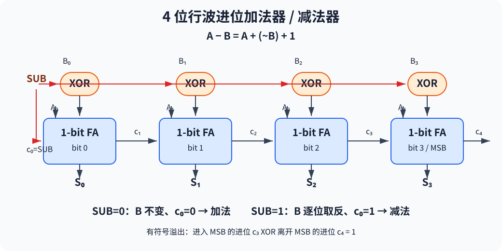
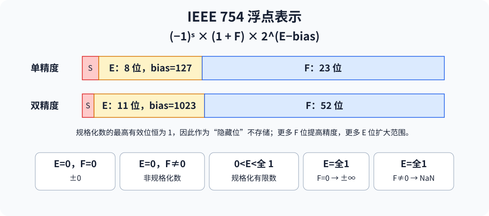
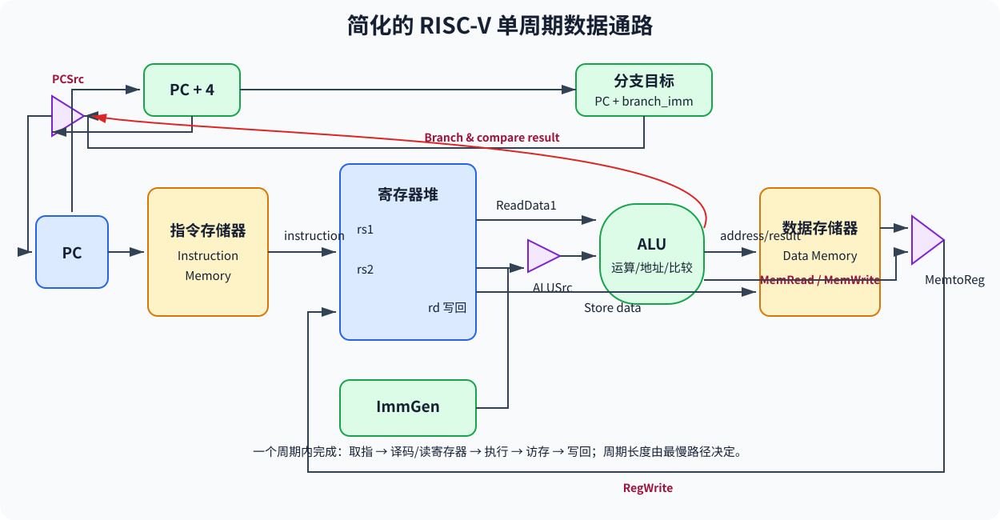
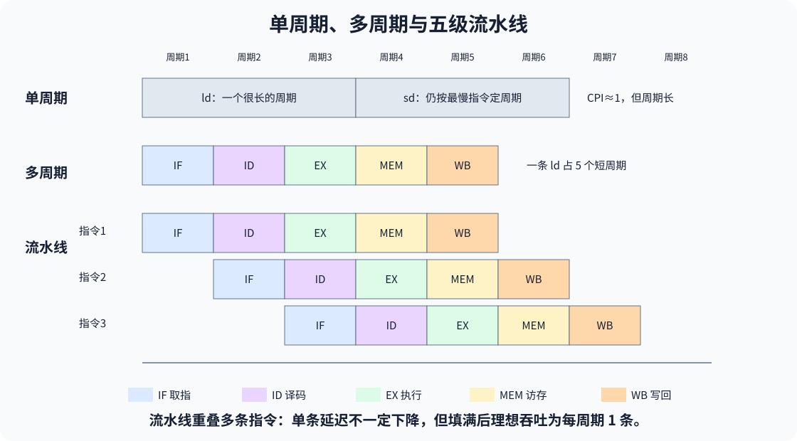
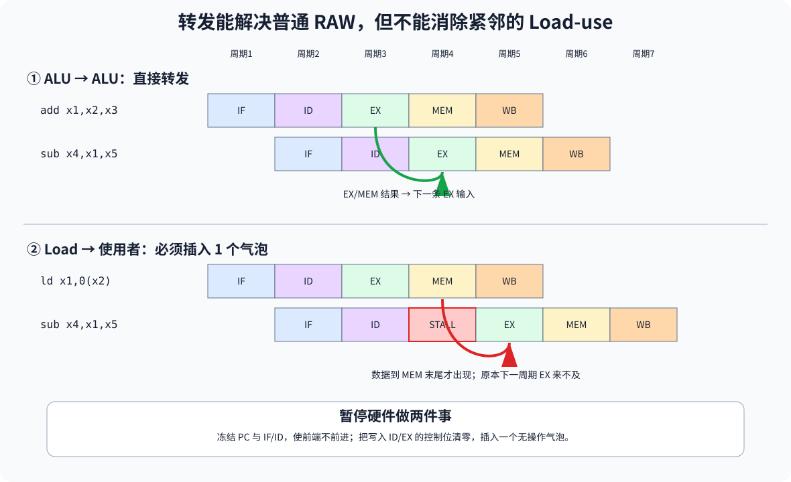

# 第 3 讲：RISC-V ALU 与基本处理器结构

> 对应课件：`3-RISC-V-Arch-Basics-2026-教学网.pptx`。已合并逐步动画页与 Backup 中的重复内容，保留 ALU、浮点、单周期、多周期、流水线和冒险处理的全部技术要点。课件部分图沿用 MIPS 字段名，本文统一按 RISC-V 概念表述，并在必要处指出差异。

## 1. ALU 需要支持的操作

整数 ALU 需要覆盖 ISA 中的主要算术、逻辑、比较和地址计算：

- 加减：`add`、`addi`、`sub`。
- 乘除扩展：`mul`、`mulh`、`mulhu`、`div`、`divu`、`rem` 等。
- 逻辑：`and/andi`、`or/ori`、`xor/xori` 等。
- 比较与分支辅助：`slt/slti/sltiu/sltu`，以及为 `beq/bne` 产生相等判断。

还要处理立即数和窄数据的扩展：大多数立即数使用符号扩展；无符号窄加载和无符号比较使用零扩展。移位通常由独立的桶形移位器完成。

RISC-V 整数运算不会因算术溢出自动陷入异常，若程序需要检测有符号溢出，应由软件显式判断。例如加法结果 `r=a+b` 发生有符号溢出的条件是：两个输入同号且结果与输入异号。可通过异或和按位与组合检查符号位。

## 2. 二进制补码

`n` 位补码的表示范围为：

\[
-2^{n-1}\le x\le 2^{n-1}-1
\]

4 位补码范围是 `-8～7`：`1000=-8`，`1111=-1`，`0000=0`，`0111=7`。

补码取负：

\[
-x=\sim x+1
\]

“按位取反”和“取负”不是一回事；取负还必须加 1。

## 3. 全加器、行波进位加法器和减法

### 3.1 1 位全加器

输入为 `A`、`B`、`carry_in`，输出为本位和 `S` 与高位进位 `carry_out`：

\[
S=A\oplus B\oplus carry_{in}
\]

\[
carry_{out}=AB+A\,carry_{in}+B\,carry_{in}
\]

`S` 是三个输入的奇校验函数；`carry_out` 是多数函数。

### 3.2 32/64 位行波进位

把多个 1 位全加器串联，低位的 `carry_out` 作为高一位的 `carry_in`，即可形成行波进位加法器（RCA）。缺点是进位需逐级传播，关键路径随位宽增长。

加减法可复用同一条加法器：

\[
A-B=A+(\sim B)+1
\]

设控制 `sub=0` 表示加法、`sub=1` 表示减法，则每一位输入改为 `B_i XOR sub`，最低位进位设为 `sub`。



*图：同一个 SUB 信号同时控制 B 的按位取反和最低位进位，因此一套全加器可完成加、减法。*

### 3.3 有符号溢出

以下情况发生溢出：

- 正数 + 正数得到负数。
- 负数 + 负数得到正数。
- 正数 − 负数得到负数。
- 负数 − 正数得到正数。

硬件等价判据：最高位的进位输入与最高位的进位输出异或为 1。

## 4. 移位

逻辑移位移出位被丢弃，空位补 0：

```asm
sll  x5, x6, x7
srl  x5, x6, x7
slli x5, x8, 8
srli x5, x8, 8
```

算术右移 `sra/srai` 用原符号位填充高位，使有符号数右移一位大体相当于除以 2。补码左移无须单独的“算术左移”，因为算术左移与逻辑左移的位操作相同，空出的低位均补 0。

桶形移位器（barrel shifter）可用组合逻辑一次完成多位移位，门数较多，但适合 VLSI 实现。

## 5. 乘法与除法

### 5.1 二进制乘法

二进制乘法本质是根据乘数各位选择部分积，再执行移位和加法：`n` 位乘数与 `n` 位被乘数产生 `2n` 位积。

迭代硬件的基本过程：

1. 检查乘数最低位；为 1 时把当前被乘数加入积。
2. 被乘数左移、乘数右移。
3. 重复 `n` 次。

改进结构把乘数放在 Product 寄存器低半部，让 Product 整体右移，从而取消独立乘数寄存器，并把被乘数寄存器和 ALU 缩至操作数位宽；Product 多保留一位容纳加法进位。

还可以展开迭代，用大量并行加法器形成部分积阵列并按树形组织，减少延迟，但显著增加面积。

RISC-V M 扩展：

```asm
mul  x5, x7, x8   # 乘积低 XLEN 位
mulh x6, x7, x8   # 有符号乘积高 XLEN 位
mulhu x6, x7, x8  # 无符号乘积高 XLEN 位
```

专用乘法器比普通加法器复杂且慢，但比软件重复移位相加快。

### 5.2 二进制除法

二进制除法本质是反复猜商位、对齐、减法和移位。迭代结构维护除数、部分余数和商：每一步试减除数；结果非负则保留并把相应商位置 1，结果为负则恢复余数并把商位置 0，然后移动到下一位。

```asm
div x5, x7, x8   # 商
rem x6, x7, x8   # 余数
```

除法硬件通常比乘法器更复杂、更慢。RISC-V 不以陷阱报告整数除法溢出或除零；如果上层程序需要错误处理，必须显式检查除数和结果语义。

## 6. IEEE 754 浮点数

大数和很小的数无法用固定 32 位整数覆盖，例如地球年龄数量级 `4.6×10^9`，原子质量单位约 `1.6×10^-27 kg`。浮点数用：

\[
(-1)^{sign}\times(1+F)\times2^{E-bias}
\]

单精度：1 位符号、8 位指数、23 位小数；双精度：1 位符号、11 位指数、52 位小数。规格化数最高有效位恒为 1，作为隐藏位不存储；指数用偏置表示，并放在小数字段之前，便于比较排序。

| 指数 | 小数 | 含义 |
|---|---|---|
| 全 0 | 全 0 | ±0 |
| 全 0 | 非 0 | 非规格化数 |
| 非全 0/非全 1 | 任意 | 规格化有限数 |
| 全 1 | 全 0 | ±∞ |
| 全 1 | 非 0 | NaN |

增加小数字段可提高精度，增加指数字段可扩大范围，二者受总位数约束而互相权衡。



*图：指数全 0 或全 1 时具有特殊含义；规格化数的最高有效 1 不存储。*

RISC-V 有独立浮点寄存器 `f0～f31`；`f0` 不像整数 `x0` 那样固定为 0。

```asm
flw f1, 54(x5)
fsw f1, 58(x5)
fadd.s f2, f4, f6
fadd.d f2, f4, f6
```

同样支持 `fsub`、`fmul`、`fdiv` 的单/双精度版本，以及比较：

```asm
flt.s x5, f2, f4   # f2<f4 时 x5=1，否则 0
flt.d x5, f2, f4
```

比较还可用 `eq`、`le` 关系。

### 6.1 浮点加减步骤

对 `(±F1×2^E1)+(±F2×2^E2)`：

1. 恢复两个尾数的隐藏位。
2. 对阶：假设 `E1≥E2`，把 `F2` 右移 `E1-E2` 位；记录保护位（guard）、舍入位（round）和粘滞位（sticky）。
3. 按符号对尾数相加或相减，得到 `F3`。
4. 规格化：同号相加结果可能落在 `[2,4)`，右移一位并增加指数；异号相减可能产生多个前导 0，需要反复左移并减小指数。
5. 舍入，必要时再次规格化。
6. 隐去最高有效的 1，再编码存储。

GRS 位让舍入使用被移出信息，从而提高精度。

## 7. 处理器组织、RTL 与时钟方法

处理器由数据通路和控制组成：

- 数据通路：寄存器堆、ALU、存储器接口等功能单元及其互连。
- 控制：取指、产生数据通路控制信号、管理指令顺序。

寄存器传输级（RTL）描述寄存器之间的数据流，给指令赋予硬件意义。例如：

- `add rd,rs1,rs2`：`Reg[rd] ← Reg[rs1]+Reg[rs2]`。
- Load：`Reg[rd] ← Mem[Reg[rs1]+sign_ext(imm)]`。
- Store：`Mem[Reg[rs1]+sign_ext(imm)] ← Reg[rs2]`。
- Branch：条件成立时 `PC ← PC + sign_ext(branch_imm)`，否则取顺序下一条。

课件部分 RTL 图沿用了 MIPS 的 `Rs/Rt/imm16` 和 `offset<<2`；RISC-V 的 B 型偏移已按 2 字节对齐编码，硬件恢复时是隐含低位 0。

### 7.1 组合部件与状态部件

- 组合部件：ALU、加法器、立即数扩展器、多路选择器等，只根据当前输入计算输出。
- 状态部件：PC、寄存器堆、指令/数据存储器、流水寄存器等，跨周期保存数据。
- 多路选择器由控制信号选择多个候选数据源之一。

### 7.2 边沿触发时钟

一个典型周期：

1. 读取状态部件。
2. 数据通过组合逻辑传播。
3. 在下一时钟边沿写入一个或多个状态部件。

时钟周期必须覆盖“寄存器输出→组合逻辑→下一级寄存器输入”的最长路径，并满足建立/保持时间。并非每周期都写的状态部件需要显式写使能；写入只在写使能有效且时钟边沿到来时发生。

## 8. 单周期数据通路

单周期处理器让每条指令在一个周期内完成取指、译码和执行，因此大多数指令 CPI=1。



*图：控制信号选择 ALU 第二操作数、写回来源和下一 PC；最慢的 Load 路径决定时钟周期。*

### 8.1 取指与译码

- PC 给出指令地址，指令存储器每周期读取。
- 顺序地址由 `PC+4` 产生；PC 每周期更新时可不设普通写使能，遇到暂停机制时则需要控制。
- opcode、`funct3/funct7` 送控制单元和 ALU 控制。
- `rs1=[19:15]`、`rs2=[24:20]` 从寄存器堆读取，`rd=[11:7]` 指定写回位置。

### 8.2 各类指令的数据流

- R 型：读 `rs1/rs2`→ALU 执行→结果写 `rd`。
- Load：读基址→符号扩展立即数→ALU 算有效地址→读数据存储器→写回 `rd`。
- Store：同样计算地址，把 `rs2` 数据写入数据存储器，不写寄存器。
- Branch：比较两个寄存器，同时由 PC 与分支立即数计算目标；条件满足时选择目标 PC。

因为寄存器堆并非每条指令都写，需要 `RegWrite`；数据存储器需要 `MemRead/MemWrite`。共享输入前放置 MUX，并用 `ALUSrc`、`MemtoReg`、`PCSrc` 等信号选择路径。

### 8.3 控制信号表

| 指令 | ALUOp | ALUSrc | Branch | MemRead | MemWrite | RegWrite | MemtoReg |
|---|---:|---:|---:|---:|---:|---:|---:|
| R 型 | `10` | 0 | 0 | 0 | 0 | 1 | 0 |
| `ld` | `00` | 1 | 0 | 1 | 0 | 1 | 1 |
| `sd` | `00` | 1 | 0 | 0 | 1 | 0 | X |
| `beq` | `01` | 0 | 1 | 0 | 0 | 0 | X |

`PCSrc` 可由 `Branch` 与比较结果组合产生。

### 8.4 单周期的优缺点

优点是结构直观、控制简单。缺点：

- 周期必须容纳最慢指令的整条关键路径，短指令也被迫等待，复杂浮点操作尤其不利。
- 同一指令一个周期内不能重复使用同一功能单元，因此常需分离指令/数据存储器并复制加法器，浪费面积。

## 9. 多周期数据通路

多周期处理器把一条指令拆成若干较短步骤，每步一个周期；不同指令可以使用不同周期数。

设计原则：

- 尽量平衡各步工作量。
- 每周期只启用一个主要功能单元。
- 同一功能单元可在不同周期被同一指令复用，因此只需一个统一存储器、一个 ALU/加法器，但每周期也只能访问或运算一次。
- 控制不仅取决于 opcode，还取决于当前执行步骤，所以使用有限状态机（FSM）。

### 9.1 五类步骤

- IF：取指并更新 PC。
- ID：译码、读寄存器、生成/扩展立即数。
- EX：执行 R 型运算、计算内存地址、比较分支并完成跳转。
- MEM：读/写内存；也可在相应状态完成 R 型写回。
- WB：把 Load 数据写回寄存器。

典型周期数：分支约 3 周期，R 型约 4 周期，Store 约 4 周期，Load 约 5 周期。

### 9.2 内部寄存器

周期边界必须保存以后还要用的数据：

- IR：指令寄存器。
- MDR：内存数据寄存器。
- A、B：寄存器堆两个读口的暂存值。
- ALUOut：ALU 结果。

这些寄存器对程序员不可见；最终跨指令保存的状态仍是架构可见的 PC、寄存器堆和内存。

### 9.3 FSM 控制

FSM 包含当前状态寄存器、下一状态函数和输出函数。opcode 告诉控制器是什么指令，当前状态告诉控制器现在处于该指令的哪一步；二者共同产生 `IorD`、`IRWrite`、`ALUSrcA/B`、`PCWrite/PCWriteCond`、`PCSource`、`MemRead/Write`、`RegWrite` 等信号。

多周期的优势是短周期、减少部件复制、按步骤有效利用时间；代价是更多内部寄存器、MUX 和更复杂的 FSM。周期不能简单缩短为单周期的 1/5，因为新增状态寄存器也有建立时间和时钟到输出开销。

## 10. 五级流水线

流水线在上一条指令完成前就启动下一条，提高的是吞吐率而不是单条指令延迟。经典五级：

1. IF：取指。
2. ID：译码、读寄存器。
3. EX：运算/地址计算。
4. MEM：访存。
5. WB：写回。

### 10.1 从多周期到流水线的结构变化

- 多条指令的不同阶段要同时运行，因此重新采用分离的指令存储器和数据存储器，并配置足够的加法器/ALU。
- 寄存器堆可共享：WB 在周期前半段写，ID 在后半段读；读写端口分离。
- 阶段间加入 `IF/ID`、`ID/EX`、`EX/MEM`、`MEM/WB` 流水寄存器。
- 后续阶段需要的数据都必须随指令传播。例如 IF 时取得的 `rd` 字段必须一直传到 WB，否则写回时已无法知道目的寄存器。
- 控制信号在 ID 产生，并与数据一起通过流水寄存器传播；EX、MEM、WB 只使用属于自身阶段的那部分控制位。

五级流水深度为 5。前 4 个周期是填充，第 5 周期各级均有指令；之后理想情况下每周期完成一条；停止取新指令后还需若干周期排空。



*图：多周期缩短单个时钟周期；流水线进一步让不同指令的不同阶段同时工作。*

### 10.2 性能与“流水线悖论”

流水线寄存器增加额外延迟，周期由最慢阶段决定，因此单条指令可能比单周期设计更慢。

课件例：各阶段延迟为 IF=1.0 ns、ID=0.6 ns、EX=0.9 ns、MEM=1.2 ns、WB=0.4 ns。

- 单周期延迟：`1.0+0.6+0.9+1.2+0.4=4.1 ns`。
- 五级流水周期：至少 `max=1.2 ns`（未计流水寄存器额外开销）。
- 单条指令经过 5 级，延迟约 `6.0 ns`，比 4.1 ns 更长。
- 流水稳定后每 1.2 ns 完成一条，吞吐相对单周期提高 `4.1/1.2≈3.42` 倍；低于理想 5 倍，因为各级不平衡。

理想 `k` 级流水执行 `N` 条无冒险指令需要约 `N+k-1` 个周期；当 `N` 很大且各级平衡时，加速比才接近 `k`。

流水越深可缩短组合逻辑段，但收益会被流水寄存器开销、阶段不平衡、冒险和功耗限制。流水带来的时序余量也可用于降低供电电压、节能；不用的部件应通过时钟门控等手段关闭。

## 11. 流水线冒险概览

冒险使下一条指令不能在预定周期正常执行：

- 结构冒险：两条指令同时争用同一硬件资源。
- 数据冒险：使用了尚未产生的数据。
- 控制冒险：分支方向或目标尚未确定，无法知道下一条应取什么。

流水时空图可用于判断总周期数、某周期各部件执行什么、冒险发生原因及修复方式。最通用的修复是等待，但会增加 CPI。

## 12. 结构冒险

若只有一个存储器，某条 Load/Store 在 MEM 级访问数据时，另一条指令又要在 IF 级取指，会争用同一端口。解决办法是分离 I$ 与 D$（或提供足够多端口）。

寄存器堆在同一周期既要 WB 写又要 ID 读，可让写发生在前半周期、读发生在后半周期，从而避免冲突。

## 13. 数据冒险

三类相关：

- RAW（Read After Write）：后一条读得太早，是真相关/数据依赖。
- WAR（Write After Read）：后一条写得太早，是反相关，由名字复用造成。
- WAW（Write After Write）：后一条写得太早，是输出相关，由名字复用造成。

经典顺序五级流水中，所有读都在 ID、写都在 WB 且按序发生，因此通常只出现 RAW；WAR/WAW 主要在乱序执行、不同写回延迟或特殊早写/晚读结构中出现，可用寄存器重命名消除名字相关。

### 13.1 Stall

让依赖指令等待，直到生产者写回正确值。方法简单但引入气泡，CPI 上升。

### 13.2 Forwarding/Bypassing

结果一在流水寄存器中可用，就直接转发到需要它的功能单元，而不等待写回寄存器堆：

- ALU 输入前增加 MUX。
- 把 `EX/MEM` 的 ALU 结果或 `MEM/WB` 的写回值连到当前 EX 的 `rs1/rs2` 输入。
- 转发单元比较各级 `rd` 与当前 `rs1/rs2`，控制 MUX。

EX/MEM 转发条件（较新的值，优先级高）：

```text
EX/MEM.RegWrite && EX/MEM.rd != x0 && EX/MEM.rd == ID/EX.rs1  -> ForwardA=10
EX/MEM.RegWrite && EX/MEM.rd != x0 && EX/MEM.rd == ID/EX.rs2  -> ForwardB=10
```

MEM/WB 转发条件（较旧的值，只有没有 EX/MEM 同名匹配时才选）：

```text
MEM/WB.RegWrite && MEM/WB.rd != x0 && MEM/WB.rd == ID/EX.rs1  -> ForwardA=01
MEM/WB.RegWrite && MEM/WB.rd != x0 && MEM/WB.rd == ID/EX.rs2  -> ForwardB=01
```

若 EX/MEM 和 MEM/WB 都匹配，必须选 EX/MEM，因为它代表更新的指令结果。

### 13.3 Load-use 冒险

普通 ALU 结果在 EX 末尾可用，可在下一周期转发；Load 数据到 MEM 末尾才可用，紧随其后的指令在同一周期 EX 就需要该值，时间上来不及，因此即使有转发仍需暂停 1 个周期。

规范化后的检测条件：

```text
ID/EX.MemRead && ID/EX.rd != x0 &&
(ID/EX.rd == IF/ID.rs1 || ID/EX.rd == IF/ID.rs2_used)
```

暂停实现：

1. 禁止 PC 和 `IF/ID` 更新，让 IF、ID 中指令原地等待。
2. 把将要写入 `ID/EX` 的 EX/MEM/WB 控制位清零，插入一条无操作气泡。
3. 下一周期 Load 数据可从 MEM/WB 路径转发。

Load 后紧跟 Store 且 Load 的值仅作为 Store 数据时，可增加 `MEM/WB → Data Memory write-data` 转发，使内存到内存复制不必按普通 load-use 情况暂停。



*图：ALU 结果在 EX 末尾即可转发；Load 数据到 MEM 末尾才产生，紧随的使用者必须等待一个周期。*

## 14. 控制冒险

条件分支使下一 PC 不再必然等于 `PC+4`。可选方案：

- 等待分支结果（stall），简单但增加 CPI。
- 把分支目标计算和条件判断前移，减少等待/冲刷流水。
- 延迟分支，由编译器安排有用指令。
- 分支预测，先猜测并继续取指，猜错再恢复。

控制冒险通常没有像普通数据转发那样彻底的通用消除手段。

### 14.1 把分支判断移到 ID

在 ID 增加目标地址加法器、比较器、MUX 和控制逻辑，可把分支罚时降到约 1 个周期。目标地址计算可与寄存器读取并行，但比较必须等读寄存器完成，因此会拉长 ID 关键路径。

ID 中的比较也需要转发：

- WB 的值可利用“前半周期写、后半周期读”自然得到。
- 若分支源寄存器由前面第二条、当前位于 MEM 的指令产生，需要从 EX/MEM 转发到 ID 比较器。
- 若分支紧跟在产生操作数的 ALU 指令之后，生产者正在 EX，与 ID 比较同周期，仍需暂停 1 个周期：冻结 PC 和 IF/ID，并向 ID/EX 插入气泡。

更深的流水线若更晚才能决定分支，错误路径指令更多，控制冒险代价也更大。

## 15. 为什么 RISC-V 适合流水线

有利因素：

- 基础指令长度统一为 32 位，可在 IF 取指、ID 译码。
- 格式少且字段位置规则，可尽早并行读取寄存器。
- 只有 Load/Store 访存，EX 可统一用来计算地址。
- 每条指令至多写一个主要结果，且通常在 MEM/WB 附近改变架构状态。

困难仍然存在：单存储器导致结构冒险，数据依赖导致 RAW，分支导致控制冒险。实际流水线性能取决于阶段平衡、转发覆盖率、暂停次数和分支处理能力，而不只取决于流水级数。
