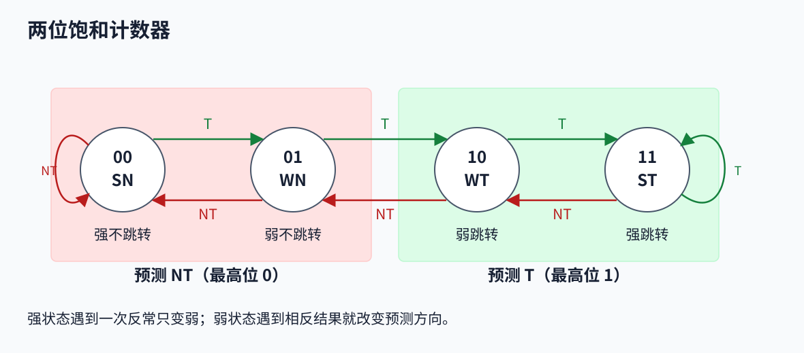
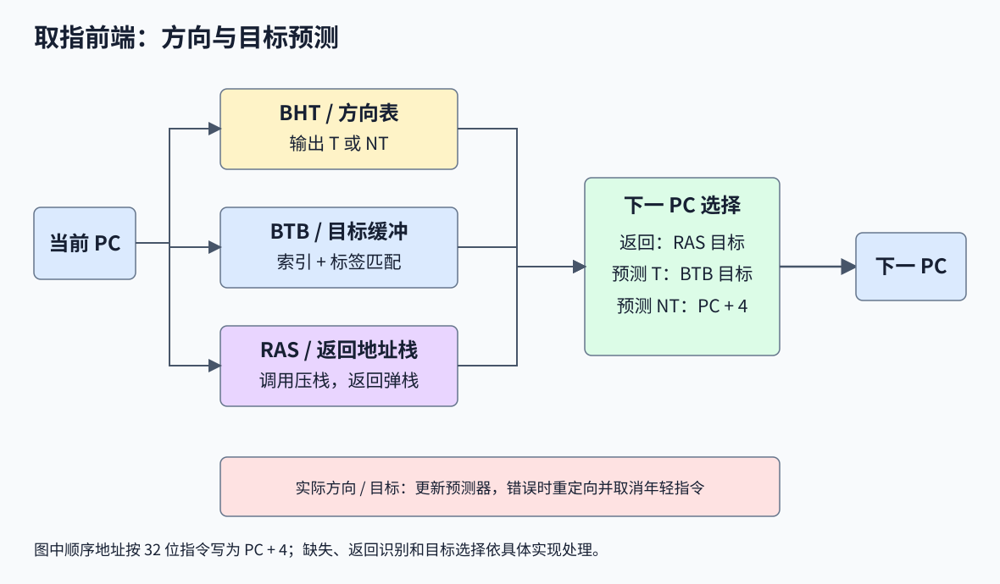
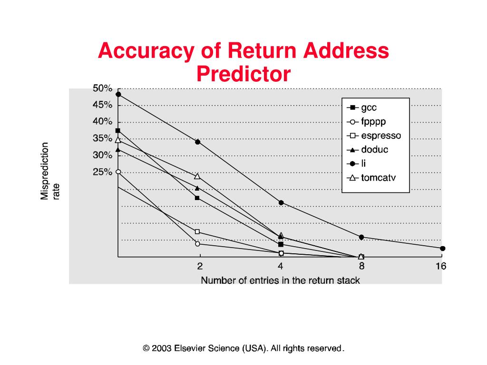
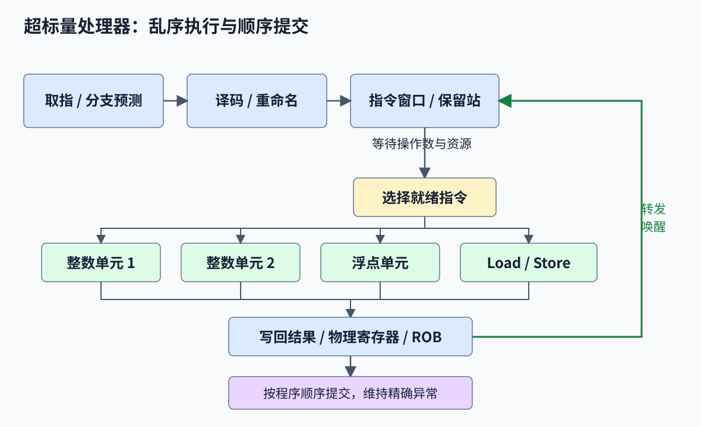
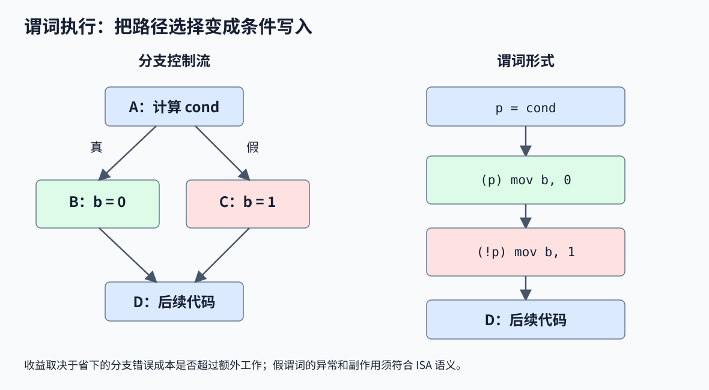
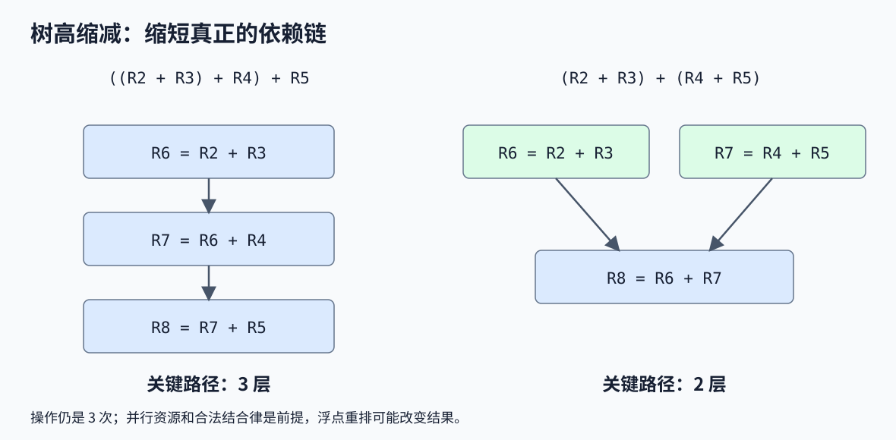
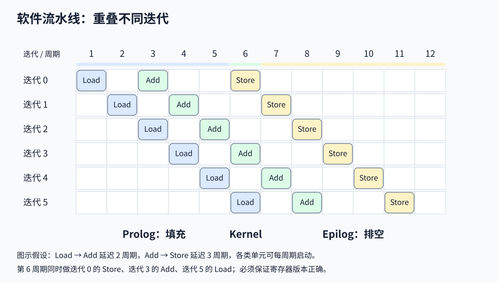

# 第 4 讲：分支预测与多发射处理器

> 对应课件：`4-MultiIssue-2026-教学网.pptx`，共 112 页。内容涵盖方向与目标预测、推测执行、超流水线、超标量、VLIW，以及编译器静态调度。重复页和动画页已合并。文中的历史准确率和处理器数据保留课件的实验背景；旧式汇编、分支延迟槽和简化时序在相关例子中单独说明。

本讲围绕指令级并行（Instruction-Level Parallelism，ILP）：流水线让不同指令的不同阶段重叠，多发射让同一周期执行更多操作。要维持这种并行，处理器必须提前选择后续取指路径，同时处理指令之间的数据依赖和资源竞争。分支预测保证前端持续供给指令，硬件或编译器调度负责找出可以并行的操作。

## 1. 分支的方向和目标

一条控制转移指令需要确定两件事：

- **方向（direction）**：是否发生跳转。Taken 简写为 `T`，Not Taken 简写为 `NT`。
- **目标（target）**：跳转后下一条指令的地址。

| 分类 | 方向 | 目标来源 | 例子和预测难点 |
|---|---|---|---|
| 条件分支 | 条件成立才跳转 | 常见为指令中的 PC 相对偏移 | `if`、`for`、`while`，主要难点是方向 |
| 直接无条件跳转和调用 | 总是跳转 | 可由指令编码计算 | `goto`、直接调用，方向已知，但前端仍需及时获得目标 |
| 间接跳转和返回 | 对无条件间接跳转而言总是跳转 | 来自寄存器值，某些 ISA/调用方式还需先读取内存 | 回调、虚函数调用、函数返回，主要难点是目标 |

RISC-V 的条件分支采用 PC 相对目标；`jal` 是直接跳转，`jalr` 是寄存器间接跳转。**“间接”不等于跳转指令一定访问内存**：RISC-V 的 `jalr` 从寄存器取得基址，函数指针可能由此前的 Load 从内存读入。

在本讲采用的 32 位指令例子中，顺序下一地址为 `PC + 4`。若支持压缩指令，应按实际指令长度计算顺序地址及返回地址。

## 2. 分支频率和控制流代价

### 2.1 课件中的分支频率

第 4 页列出 SPEC2006 的历史测量。`Total Instructions` 表示动态执行指令数，分支百分比也按动态执行次数统计。

| Core i7、x86、SPEC2006 INT | 动态指令数 | 分支占比 |
|---|---:|---:|
| astar | 5.71 × 10¹⁰ | 6.9% |
| bzip2 | 4.25 × 10¹⁰ | 11.1% |
| hmmer | 2.57 × 10¹⁰ | 5.3% |
| gcc | 6.29 × 10⁹ | 15.1% |
| gobmk | 8.93 × 10¹⁰ | 12.1% |
| h264 | 1.09 × 10¹¹ | 7.1% |
| libquantum | 4.18 × 10⁸ | 13.2% |
| omnetpp | 2.55 × 10⁹ | 16.4% |
| perlbench | 2.91 × 10⁹ | 17.3% |
| sjeng | 2.11 × 10¹⁰ | 14.8% |
| 课件汇总 | — | 9.4% |

| Cortex-A9、ARMv7、SPEC2006 FP | 动态指令数 | 分支占比 |
|---|---:|---:|
| bwaves | 3.84 × 10¹¹ | 13.5% |
| cactusADM | 1.02 × 10¹⁰ | 0.5% |
| leslie3D | 4.92 × 10¹⁰ | 6.2% |
| milc | 1.38 × 10¹⁰ | 6.5% |
| tonto | 1.30 × 10¹⁰ | 10.0% |
| 课件汇总 | — | 12.15% |

汇总数不能用各行百分比的简单算术平均代替，应考虑动态指令数的权重；各行已取舍有效数字，重新计算会有舍入差异。课件据此概括：约每 10～11 条整数指令、每 8 条浮点测试中的指令就会遇到一次分支。

Backup 的分支构成图还给出：SPEC2000 INT/FP 中，条件分支分别约占全部分支的 `73%/82%`，普通 Jump 约占 `6%/10%`，Call/Return 约占 `19%/8%`。这里的分母是**分支指令**，与上表“分支占全部指令的比例”不同。

### 2.2 深流水线和多发射放大等待代价

从计算下一 PC 到分支真正执行并解析结果，可能隔着 `B` 个周期。课件用超过 10 级的路径说明：若每次都等实际结果，取指前端会频繁停顿。4 路超标量每周期可处理 4 条指令，因此约每 10 条指令一个分支时，平均每几个周期就会遇到分支。

以每条动态指令的分支频率为 `f_b`、错误率为 `m`、平均错误惩罚为 `P`，在简单且惩罚不重叠的模型中：

$$
CPI \approx CPI_{base} + f_b\,m\,P
$$

例如 `f_b = 0.1`、准确率 `95%`、错误惩罚 `15` 周期，则额外 CPI 为 `0.1 × 0.05 × 15 = 0.075`。这是帮助理解的计算例，不是某款处理器的测量结果；真实机器还受带宽、Cache miss、恢复过程和惩罚重叠影响。

## 3. 分支为什么可以预测

循环回跳常具有稳定模式：循环还没结束时连续 `T`，退出时出现一次 `NT`。例如五次条件检查可能得到：

```text
T T T T NT | T T T T NT | …
```

程序的多个分支还可能互相关联。课件的例子是：

```c
if (aa == 2) aa = 0;
if (bb == 2) bb = 0;
if (aa != bb) {
    /* ... */
}
```

若前两个赋值都执行，`aa` 和 `bb` 都变为 0，第三个条件必为假。由此可利用之前分支的结果改进后续预测。具体汇编中的 `T/NT` 还取决于编译器是对条件为真还是为假跳转，不能直接把“进入 if”一律当作 `T`。

## 4. 静态方向预测

静态策略不根据每次运行中新产生的分支结果持续学习。同一分支通常采用固定规则或编译器提供的信息。

| 策略 | 做法 | 适用性和课件数据 |
|---|---|---|
| Always Not Taken | 总预测 `NT`，继续取顺序指令 | 实现简单，课件的 SPECint92 示例约 30%～40% |
| Always Taken | 总预测 `T` | 同一二选一数据集上与 Always NT 互补，约 60%～70% |
| BTFNT | Backward Taken、Forward Not Taken | 向低地址的后向分支预测 `T`，向高地址的前向分支预测 `NT`，适合常见循环回跳 |
| Compiler Directed | 编译器分析或 profiling 后提供预测信息 | 课件示例约 75%，依赖训练数据及 ISA/实现支持 |

BTFNT 的判断对象是**目标相对当前分支的方向**，不是随意选两个地址中较小的一个。包含不规则控制流的程序不一定满足该经验。

反馈指导编译（feedback-directed compilation）的过程是：先编译并用代表性输入运行，记录各分支的典型方向，再重新编译以调整提示、布局等。预测提示位并非所有 ISA 都提供。

### 4.1 预测不跳转后的冲刷

若预测 `NT`，实际却为 `T`，应取消已经进入流水线的错误路径指令，并从真实目标重新取指。在课件的五级流水线模型中：

| 分支解析位置 | 后续错误路径可能占据的阶段 | 简化惩罚 |
|---|---|---:|
| MEM | IF、ID、EX | 3 周期 |
| EX | IF、ID | 2 周期 |
| ID | IF | 1 周期 |

这些数值假设重定向在相应时序边界生效，不能只看“在哪一级比较”就推断任何处理器的惩罚。Branch/Jump 可以在 ID、EX 或其他阶段解析，取决于比较器、目标加法器、旁路和 PC 更新电路放在哪里。

要保证被取消的年轻指令没有修改正确程序状态。简单顺序流水线通常在 MEM 才写数据存储器、WB 才写寄存器，因此及时清除其写使能即可阻止错误路径写入。

### 4.2 停顿和冲刷

| 操作 | 对指令的处理 | 常见实现 |
|---|---|---|
| Stall，停顿 | 保留尚不能前进的正确指令 | 冻结 PC/相应流水寄存器，在后方插入 Bubble，让更老指令继续走 |
| Flush/Squash，冲刷/取消 | 丢弃错误或不再需要的指令 | 将对应流水寄存器的控制位清零，形成无副作用的 Bubble |

Load-use 冒险中的“冻结前端、插入空泡”与分支预测错误中的“丢掉错误路径”用途不同。Bubble 是没有有效工作的流水线位置，不一定对应程序中真的编码了一条 `nop`。

### 4.3 方向猜对仍可能等目标

若采用 Always Taken，但目标要到 ID 才算出，课件的简单设计仍有 1 周期等待。缓存目标、在 IF 查表或设置更早的重定向路径，才可能消除这部分等待。Backup 中“该设计不能降为 0”的结论只针对其 PC/取指寄存器路径，不能推广为所有流水线的必然限制。

## 5. 动态预测和一位 BHT

动态预测器根据运行时的实际结果更新内部状态。最简单的方法是预测“这次与上次相同”。

分支历史表（Branch History Table，BHT）用分支 PC 的若干位或其哈希作为索引，每个表项保存一位：

```text
0：预测 NT
1：预测 T
分支解析后：表项 = 本次实际结果
```

若索引宽度为 `k` 位，可选择 `2^k` 个表项。一位 BHT 的方向状态共 `2^k` bit；这里的 `2^k` 与容量记法 `2K = 2048` 不要混淆。

| 旧状态 | 本次预测 | 实际 `NT` 后的新状态 | 实际 `T` 后的新状态 |
|---|---|---|---|
| 0 | NT | 0 | 1 |
| 1 | T | 0 | 1 |

PC 低位相同或哈希冲突的不同分支可能使用同一表项，称为**别名/干扰（aliasing）**。因此 BHT 表项不必与每条分支一一对应。错误预测会损害性能，但在正确取消错误路径的前提下不会改变程序结果。

课件的历史数据：一位方案约 80% 准确率，示例实现包括 Alpha 21064/21066 的 2K 表项和 AMD K5、R8000 的 1K 表项。Backup 列出 4096-bit BHT 在不同旧基准中约 `1%～18%` 的错误率，说明准确率强烈依赖程序。

### 5.1 五次检查的循环

假设实际方向为 `T T T T NT`，初始表项为 0：

| 检查 | 检查前状态 | 预测 | 实际 | 正误 | 更新后 |
|---|---:|---|---|---|---:|
| 1 | 0 | NT | T | 错 | 1 |
| 2 | 1 | T | T | 对 | 1 |
| 3 | 1 | T | T | 对 | 1 |
| 4 | 1 | T | T | 对 | 1 |
| 5 | 1 | T | NT | 错 | 0 |

退出后状态变成 0，下一次进入同样的循环，第一次 `T` 又会猜错。因此重复调用且没有别名干扰时，每轮通常错两次，准确率为 `3/5 = 60%`。

若每轮有 `N` 次条件检查，模式为 `T^(N−1), NT`，对于足够长的循环，一位预测器的稳态准确率为：

$$
A_{1bit}=\frac{N-2}{N}
$$

这里的 `N` 按**该分支实际执行次数**计数，应先确定循环形态，不能直接把 C 源码的循环次数机械代入。第一次运行也取决于初始化状态。

## 6. 两位饱和计数器

一位预测器遇到一次反常结果就改变方向。两位方案增加“确信程度”，用四个状态减弱偶发反常的影响：

| 编码 | 名称 | 含义 | 预测 |
|---|---|---|---|
| 00 | SN，Strongly Not Taken | 强不跳转 | NT |
| 01 | WN，Weakly Not Taken | 弱不跳转 | NT |
| 10 | WT，Weakly Taken | 弱跳转 | T |
| 11 | ST，Strongly Taken | 强跳转 | T |

最高位给出预测方向，最低位参与表示迟滞（hysteresis）。按无符号数把状态记作 `c ∈ {0,1,2,3}`：

$$
c'=
\begin{cases}
\min(c+1,3), & \text{实际为 T}\\
\max(c-1,0), & \text{实际为 NT}
\end{cases}
$$

饱和意味着到 3 后再加仍为 3，到 0 后再减仍为 0。



*图：从 ST 遇到一次 NT 只退到 WT，仍预测 T；再遇到 NT 才进入预测 NT 的 WN。*

| 旧状态 | 实际 NT | 实际 T |
|---|---|---|
| 00 | 00 | 01 |
| 01 | 00 | 10 |
| 10 | 01 | 11 |
| 11 | 10 | 11 |

“预测错两次才改变方向”只适合解释**强状态对相反结果的迟滞**。从弱状态出发，一次相反结果就能改变预测方向。两位计数器也不是“保存最近两个结果”的两位历史寄存器。

### 6.1 同一个循环的逐次更新

模式仍为 `T T T T NT`，初始状态 `01`：

| 检查 | 检查前状态 | 预测 | 实际 | 正误 | 更新后 |
|---|---|---|---|---|---|
| 1 | 01 | NT | T | 错 | 10 |
| 2 | 10 | T | T | 对 | 11 |
| 3 | 11 | T | T | 对 | 11 |
| 4 | 11 | T | T | 对 | 11 |
| 5 | 11 | T | NT | 错 | 10 |

冷启动第一轮仍是 60%。但下一轮从 `10` 开始，前四次都预测 `T`，只在退出时出错，准确率升为 `4/5 = 80%`。课件的 80% 是训练后的循环表现，不应当作这组初始化条件下第一轮的结果。

对于形成稳定 Taken 状态的长循环：

$$
A_{2bit}=\frac{N-1}{N}
$$

例如 `N = 100` 时为 99%，`N = 100000` 时为 99.999%。短循环、初始状态、交替模式和表项干扰会改变这一结论。

课件的历史准确率曲线给出两位方案最好约 90%，Backup 的另一组说明约 80%，二者背景不同。历史表项示例包括 Alpha 21064A 的 4K、21164/Nx586 的 2K，以及 PPC 620 的 2K、PPC 604/R10000/UltraSPARC 的 512、Cyrix M1/PA-8000/Pentium 的 256。它们是历史实现示例，不能用表项数量单独推断准确率。

## 7. 两级预测和混合预测

### 7.1 两级预测

两级预测器先记录历史模式，再根据模式选择预测状态：

1. **第一层历史**：用 `k` 位移位寄存器记录最近的 `k` 个方向。可记录同一分支的局部历史，或多个分支的全局历史。
2. **第二层模式表**：模式历史表（Pattern History Table，PHT）为历史模式保存预测状态，常用两位饱和计数器。

历史寄存器内容例如 `101`，按“从旧到新”解释为 `T、NT、T`。该模式选择一个 PHT 表项；同一条分支在不同历史模式下可以使用不同计数器。

```text
预测：分支 PC / 历史表 -> 得到历史 h -> 选择 PHT[h] -> 读取预测方向
更新：用实际结果更新此次预测所选的 PHT 项，再将实际结果移入历史
```

实际实现可结合 PC 与历史分配/索引模式表，避免所有分支无区别地共用状态。若局部历史表有 `M` 个 `k` 位寄存器，共享 PHT 有 `2^k` 个两位计数器，则简化状态容量为 `Mk + 2 × 2^k` bit，不计标签和其他元数据。

对于 `T、NT、T、NT` 的交替模式，一位预测器总追随上一次，往往持续猜错；使用一位历史区分“上次 T”和“上次 NT”，两个 PHT 项可以分别学习“下一次 NT”和“下一次 T”。这说明**历史模式的信息**与**计数器的确信程度**用途不同。

课件给出的两级方案最好约 96%。两级自适应预测的历史寄存器和 PHT 结构可对照 [Yeh 与 Patt 的原始论文](https://people.eecs.berkeley.edu/~kubitron/courses/cs252-S11/handouts/papers/p451-yeh.pdf)。

### 7.2 混合预测或竞赛预测

Hybrid/Tournament Predictor 同时运行多个预测器，由选择器决定采用哪个结果。例如局部预测器适合分支自身的重复模式，全局预测器适合分支间相关性。

选择器也学习运行结果：当两个预测器意见不同，实际方向能说明应倾向哪一个；若两者都对或都错，就没有同样明确的胜负信息。它解决的是“对这类历史情形，哪个预测器更可靠”。

课件的历史曲线给出最好约 97%，代表实现是 Alpha 21264。**两级与混合属于不同概念**：两级描述历史到模式状态的组织，混合描述如何组合多个预测器。可参考 [Berkeley 对局部、全局与选择预测器的说明](https://www-inst.eecs.berkeley.edu/~cs152/sp26/lab/lab3/open/)。

## 8. BTB 目标预测

BHT 主要回答“跳不跳”，不会自动给出跳到哪里。分支目标缓冲（Branch Target Buffer，BTB）在取指前端缓存分支 PC 与目标地址之间的对应关系。

典型表项包含有效位、分支地址标签（tag）和目标地址，具体设计还可能保存分支类型等信息。查询时用当前 PC 选择候选表项，再比较标签。标签用于区分映射到同一索引的不同地址，避免把别的分支目标当成当前目标。

在简化设计中：

$$
NextPC=
\begin{cases}
BTB.target, & BTB\ hit\ \text{且方向预测为 T}\\
PC+4, & \text{否则}
\end{cases}
$$

BTB 查找可与 I-cache 访问并行。命中目标使处理器能在真正译码、执行分支之前开始取预测路径；查找缺失、目标错误或方向错误都可能需要等待或恢复。



*图：方向表提供 T/NT，BTB 提供目标，RAS 优先为返回指令提供目标；实际分支结果用于更新和错误恢复。*

课件第 30 页展示的方案同时准备顺序指令和目标指令，可能需要两个取指读端口；也可在缓冲中直接保存目标指令。另一类实现只预测下一 PC，再访问对应路径。**双读端口是该图的设计选择，并非所有 BTB 的必要条件。**

## 9. RAS 返回地址预测

同一个函数可以从多个调用点进入，所以同一条返回指令的目标会变化。仅把它最近一次的目标放进 BTB，很难处理交替调用和嵌套调用。

返回地址栈（Return Address Stack，RAS）利用调用和返回的后进先出关系：

- 遇到调用，把返回地址压栈。
- 遇到返回，使用栈顶作为预测目标并弹栈。

对 32 位调用指令，返回地址通常为调用 `PC + 4`。课件中 `bar` 的三个调用点 `0x10001000`、`0x10001800`、`0x10001CE4` 分别应返回 `0x10001004`、`0x10001804`、`0x10001CE8`。

嵌套例子：

```text
foo 在 0x10001000 调 bar：压入 0x10001004
bar 在 0x1000F0E0 调 baz：压入 0x1000F0E4
baz 返回：弹出 0x1000F0E4，回到 bar
bar 返回：弹出 0x10001004，回到 foo
```

RAS 是预测器内部的小栈，不是存放局部变量和寄存器保存值的程序内存栈，也不能代替真实调用/返回语义。有限容量、非常规调用行为及推测路径可能影响它的预测状态，错误时仍需恢复。



*图：纵轴实际是 Misprediction rate，越低越好；横轴为返回地址栈的条目数。课件所示旧基准在增加到 8～16 项时已达到较低错误率，不能据此断言任意程序都只需要 16 项。*

课件的历史容量示例为 MIPS R10K 的 1 项、Alpha 21164 的 12 项和 Intel Pentium III 的 16 项。

## 10. 推测执行和错误恢复

分支预测让处理器提前取指，**推测执行（speculative execution）**进一步让未确认路径上的指令开始执行。课件列出三项支持：

1. 预测后续指令流：方向预测和目标预测共同决定路径。
2. 管理乱序执行结果：重排序缓冲（Reorder Buffer，ROB）等结构保存尚不能提交的结果。
3. 预测错误后恢复：取消错误路径指令，恢复正确状态，并从真实路径重新取指。

需要区分三个时刻：

- **执行完成**：功能单元已算出结果。
- **写回**：结果进入物理寄存器、ROB 或结果缓冲，也可能供后续指令使用。
- **提交/退休（commit/retire）**：确认该指令可按程序顺序成为有效程序状态的一部分。

采用顺序提交的乱序处理器可以让年轻指令先算完，但先保持其结果为暂时状态。分支错了，丢弃该分支之后的年轻指令和相关结果，再恢复重命名/预测状态。Store 也需要控制何时对正确程序状态产生可见影响，不能让错误路径直接覆盖有效内存。

在这种组织下，预测错误主要付出取指、执行和恢复时间；预测机制不改变正确程序的语义。ROB 还帮助维持精确异常：异常发生时，可以呈现“之前指令已完成、之后指令未生效”的状态。

## 11. 长操作与流水线划分

不同操作的延迟不一样。若乘法约需普通 EX 的两倍时间，可以选择把全机时钟放慢，也可以让乘法占两个周期。类似地，若数据存储器访问比指令存储器慢，可以把 MEM 拆成 `DM1/DM2`，而保留较短时钟。

这会改变指令延迟、资源占用和依赖等待。必须区分：

| 指标 | 含义 |
|---|---|
| Latency，延迟 | 从操作开始到结果可用需要多久 |
| Initiation Interval，启动间隔 | 同一个单元隔多久能接收下一项操作 |

例如流水化乘法器可以延迟 4 周期、每周期接收一次新乘法；非流水化乘法器可能执行期间一直占用单元。**延迟长不必然意味着吞吐率低**，但依赖其结果的消费者仍要等。

## 12. 单发射流水线和超流水线

### 12.1 五级流水线的性能例子

课件给出各阶段组合延迟：

| 阶段 | IF | ID | EX | MEM | WB |
|---|---:|---:|---:|---:|---:|
| 延迟 | 1.0 ns | 0.6 ns | 0.9 ns | 1.2 ns | 0.4 ns |

忽略流水寄存器和时钟额外开销，单周期时间为：

$$
T_{single}=1.0+0.6+0.9+1.2+0.4=4.1\ ns
$$

流水线周期由最慢阶段决定，为 `1.2 ns`。填满且没有冒险后，每周期完成一条指令，长程序的理想吞吐加速为：

$$
S\approx\frac{4.1}{1.2}=3.42
$$

不是 5 倍，因为阶段不均衡。流水线的一条指令仍要走多个周期，流水寄存器还增加延迟。对 `n` 条指令，五级流水线的理想总时间近似 `(n + 4) × T_pipe`，只有 `n` 足够大才可忽略填充和排空。

### 12.2 超流水线

超流水线（super-pipelining）把阶段继续细分。若原周期为 `T`，理想均衡拆为 `m` 个子阶段，新周期可接近 `T/m`；单发射机器在每个更短的周期仍最多发射一条，相同实际时间内能启动更多指令。

实际周期至少还包括流水寄存器延迟、时钟偏差及建立时间，不能无限按 `T/m` 缩短。更深流水线会提高分支错误的周期惩罚，并让某些消费者在更多周期后才能得到结果。

课件用两个示意例强调风险：32 级结构在较晚解析分支，可能取消 31 条年轻指令；Load 在第 40 级才给出值、消费者在第 25 级需要值，示意等待 15 周期。这些数字来自该时序示意，不是所有深流水线的固定代价。

因此存在与微体系结构、工作负载相关的合适深度。课件引用约 15 级的某项研究结果，表达的是继续加深可能收益递减；它不构成通用的最佳级数规则。

## 13. 多发射和超标量

多发射（multiple issue）允许每周期启动多条指令或多个操作。N 路超标量（N-way superscalar）由硬件在运行时选择可并行的指令，峰值发射宽度为每周期 `N` 条。

要支持它，需要匹配的取指/译码带宽、足够的寄存器读写端口、多个功能单元，以及访问存储器、转发和选择的电路。简单的 N 条双源单目的运算，可能需要支持最多 `2N` 个源读取和 `N` 个结果写入；真实设计会按操作类型和实现划分端口。

超流水线增加深度、缩短周期，超标量增加宽度、在一个周期做更多操作，两者可以结合。

| 方式 | 理想改善来源 | 主要限制 |
|---|---|---|
| 普通流水线 | 不同指令阶段重叠 | 冒险、阶段不均衡、寄存器开销 |
| 超流水线 | 更短的周期 | 时钟开销、分支惩罚、依赖延迟 |
| 超标量 | 同一周期多个独立操作 | 可用 ILP、功能单元和前后端带宽 |

若所有指令独立、资源充足、周期相同，N 路超标量相对同频单发射机器的理想吞吐加速可达 N。若是严格依赖链，增加发射宽度不能让消费者提前使用不存在的结果。

IPC 是每周期完成/退休的指令数，CPI 是每条指令平均周期数；使用同一统计口径时 `IPC = 1/CPI`。多发射可使 CPI 小于 1，峰值宽度则不等于实际平均 IPC。

### 13.1 求和循环中的独立操作

课件的 `sum += a[i--]` 简化为：

```asm
loop:
    ld   r2, 10(r1)
    add  r3, r3, r2
    sub  r1, r1, 1
    bne  r1, r0, loop
```

这是教学汇编，地址偏移和步长应按实际数组元素大小调整。依赖包括 `ld -> add` 的 `r2`，以及 `sub -> bne` 的 `r1`。若 Load 已经读取了旧 `r1`，更新指针可以与某个独立加法重叠；若同时读写 `r1`，硬件必须保证 Load 使用原来的基址。

还要注意跨迭代的 `r3` 累加依赖：下一次加法需要上一次的和。所以寻找同一迭代内的独立指令，并不意味着整个循环没有依赖链。

## 14. 发射顺序和完成顺序

发射前通常会经过取指、译码及进入指令队列；**进入队列不等于已经开始执行**。本节课件把前端栏写作 `Decode/Issue`，其图中有些指令已列入前端栏却仍在等待功能单元，应结合执行栏读时序。

| 策略 | 说明 | 影响 |
|---|---|---|
| 顺序发射、顺序完成 | 后续指令不能绕过尚未发射的更老指令，结果按程序顺序生效 | 受代码排列影响大，年轻独立操作容易等待 |
| 乱序发射、乱序完成 | 从已看到的指令中选择就绪项，较年轻指令可先算完/写回 | 需处理数据和资源约束，并解决有效状态与异常顺序 |
| 乱序执行、顺序提交 | 执行和临时结果可乱序，最终按程序顺序退休 | 常用 ROB 兼顾并行性、恢复和精确异常 |

课件有时用 completion 指寄存器/内存写入。分析现代乱序结构时，应进一步区分临时写回与提交。

### 14.1 六条指令的完整例子

```text
I1: ADDF R12, R13, R14    # 浮点加法
I2: ADD  R1,  R8,  R9
I3: MUL  R4,  R2,  R3
I4: MUL  R5,  R6,  R7
I5: ADD  R10, R5,  R7
I6: ADD  R11, R2,  R3
```

课件设 `I1` 执行 2 周期，其余示意操作为 1 周期；只有一个浮点加、一个整数加、一个乘法单元。`I3/I4` 争乘法单元，`I2/I5/I6` 争整数加单元，`I5` 对 `I4` 有 RAW 真依赖。前端每周期展示两条指令。

原顺序的课件时序如下，空格表示该栏没有新活动：

| 周期 | 译码/入队 | 执行 | 完成 |
|---:|---|---|---|
| 1 | I1、I2 | — | — |
| 2 | I3、I4 | I1 第 1 拍、I2 | — |
| 3 | I5、I6 | I1 第 2 拍 | — |
| 4 | — | I3 | I1、I2 |
| 5 | — | I4 | I3 |
| 6 | — | I5 | I4 |
| 7 | — | I6 | I5 |
| 8 | — | — | I6 |

该模型的严格顺序和等待规则造成明显空闲，最终在第 8 周期完成。它是指定时序图的结果，不能据此推断任何顺序发射机器都必须等 `I1` 完成才能执行 `I3`。

编译器把顺序改为 `I1、I2、I6、I4、I5、I3`，仍保持 `I4 -> I5`：

| 周期 | 译码/入队 | 执行 | 完成 |
|---:|---|---|---|
| 1 | I1、I2 | — | — |
| 2 | I6、I4 | I1 第 1 拍、I2 | — |
| 3 | I5、I3 | I1 第 2 拍 | — |
| 4 | — | I6、I4 | I1、I2 |
| 5 | — | I5、I3 | I6、I4 |
| 6 | — | — | I5、I3 |

在相同图示规则下缩短为 6 周期，因为整数加和乘法有更多重叠。课件第 55 页把 `I6` 的目的误写成 `R1`，这里按其定义修正为 `R11`。

保持原代码顺序、由硬件乱序选择，课件给出：

| 周期 | 译码/入队 | 执行 | 完成 |
|---:|---|---|---|
| 1 | I1、I2 | — | — |
| 2 | I3、I4 | I1 第 1 拍、I2 | — |
| 3 | I5、I6 | I1 第 2 拍、I3 | I2 |
| 4 | — | I6、I4 | I1、I3 |
| 5 | — | I5 | I4、I6 |
| 6 | — | — | I5 |

`I2` 可先于 `I1` 完成，`I6` 可绕过等待 `I4` 的 `I5`。乱序调度减少等待，但**不能消除 `I4 -> I5` 的真数据依赖**；必须仍保证 `I5` 使用 `I4` 的正确结果。

## 15. 超标量的约束和整体结构

硬件既要检查同周期译码的指令彼此之间的冲突，又要检查它们与此前已进入机器、尚未结束的指令之间的冲突。

| 约束 | 含义 | 应对方式 |
|---|---|---|
| RAW，先写后读的真依赖 | 后一条读取前一条要产生的值 | 等结果、旁路转发、调整调度 |
| WAR，先读后写的反依赖 | 年轻指令不能覆盖老指令尚未读取的值 | 保证读取顺序、寄存器重命名 |
| WAW，先写后写的输出依赖 | 对同一目的的两次写入要保留正确最终值 | 控制写回/提交顺序、寄存器重命名 |
| 资源约束 | 功能单元、端口、队列或存储带宽不足 | 等待、增加资源、按可用资源调度 |
| 控制依赖 | 后续指令是否执行受分支决定 | 分支预测、推测执行、循环展开等 |

最保守的方法是发现任何冲突就停在译码阶段。更灵活的机器让可执行指令继续前进，由记分牌（scoreboard）记录状态，或利用 Tomasulo 一类的保留站与重命名技术跟踪操作数。ROB 则管理提交顺序及异常恢复。课件在此列出这些机制，具体算法留待后续内容。



*图：指令窗口等待操作数和资源，就绪指令可进入不同功能单元；完成结果向等待者转发，最终按程序顺序提交。*

典型流程为：取指与分支预测、指令缓冲、译码与重命名、派送到指令窗口/保留站、选择就绪指令、功能单元执行、写回、提交。指令窗口不是无限大，能发现的并行性受其容量和前端供给限制。

课件列出历史例子：PowerPC 6xx 有分支、Load/Store、三个整数和一个浮点单元；Pentium I 的示例有三个独立单元；Pentium II 采用乱序组织，课件给出单周期可发射五条的示意规格。功能单元数、发射宽度和退休宽度应分别理解。

## 16. VLIW 静态多发射

VLIW（Very Long Instruction Word，超长指令字）让编译器预先找出可并行操作，并编码进同一个长指令/指令束（bundle）的不同槽位。每个槽位对应指定种类的功能单元。

它将 ILP 显式放进软硬件接口：编译器根据目标机器的单元、延迟、旁路和资源约束安排操作，硬件按既定槽位执行。课件列出的相关实例是 Itanium/IA-64 的 EPIC（Explicitly Parallel Instruction Computing）；EPIC 采用显式并行思想，还包含其他机制。

### 16.1 TinyRV1 的四条执行管线

| 管线 | 示例操作 | 课件延迟 |
|---|---|---:|
| Y-pipe | `mul` | 4 周期 |
| X-pipe | `add` | 1 周期 |
| L-pipe | `lw` | 2 周期 |
| S-pipe | `sw` | 2 周期 |

在课件的 TinyRV1 教学设计中，不依赖硬件全面检查冒险，ISA 可提供旁路选择相关控制，编译器承担合法时序的责任。以下四条不能简单塞进同一个同时执行的束：

```asm
mul x1, x2, x3
add x4, x1, x5       # 等 mul 的 x1
lw  x6, 0(x7)
sw  x6, 0(x8)        # 等 lw 的 x6
```

`mul/lw` 可以在资源和其他条件允许时并行启动；`add/sw` 要安排到其操作数可用的后续周期。该例说明“槽位够”不等于“依赖满足”。

### 16.2 优点和限制

VLIW 可以减少复杂的运行时依赖检查，硬件因而可能更简单、耗电更低；增加槽位和功能单元可以提高潜在并行宽度。但编译器更复杂，面对长延迟和深流水线也更难排满槽位。

经典锁步实现遇到不能继续的事件，可能让后续指令束一起等待。VLIW 的具体实现并非都采用完全相同的停顿机制。其他代价包括：

- 代码增长：空槽中的 NOP、循环展开和补偿代码占存储空间。
- 指令字较宽，对取指带宽要求高。
- 编译时间和调度复杂度增加。
- 二进制可能依赖机器的槽位、单元与延迟；换实现后需要兼容支持或重新编译。

### 16.3 与 CISC、RISC、超标量的关系

| 维度 | 经典 CISC 教学模型 | 经典 RISC 教学模型 | 超标量 | VLIW |
|---|---|---|---|---|
| 编码 | 常有变长、多格式 | 常强调规则格式 | 取决于其 ISA | 指令束中显式表示并行槽位 |
| 寄存器 | 旧式例子较少且有专用寄存器 | 较多通用寄存器 | 可使用物理寄存器重命名 | 通常需要较多寄存器供静态调度 |
| 内存操作 | 某些运算允许内存操作数 | Load/Store 分离 | 取决于其 ISA 和后端 | 经典模型使用专门访存槽位 |
| 主要挑战 | 译码复杂性 | 冒险与转发 | 动态依赖检查和资源分配 | 编译器排程、代码体积及兼容性 |

**CISC/RISC 与超标量不是互斥分类**：前者主要描述 ISA 风格，后者描述多发射实现。x86 或 RISC-V 都能采用超标量；RISC-V 有压缩指令时也不是所有指令都固定 32 位。课件第 70 页的四列表应按历史教学模型理解。

## 17. 静态调度和动态调度

编译器把高级语言程序转换为语义等价的目标代码，并可在转换过程中进行优化。静态调度在编译时重排代码，动态调度在运行时根据实际就绪情况选择指令。共同目标是在保持语义的前提下减少空闲周期。

| 方式 | 长处 | 局限 |
|---|---|---|
| 编译器静态调度 | 分析时间充足，可看更大代码范围、跨过程信息和高层语义 | 无法准确知道每次分支方向、Cache miss 或其他动态延迟 |
| 硬件动态调度 | 能看到本次执行实际操作数和资源状态 | 决策时间短、窗口有限、硬件复杂 |

静态调度希望把足够多的独立指令排列在一起，达到目标机器的执行带宽。3 路机器不需要同一周期安排 7 条操作，但更大的独立指令集合可以填补后续空档。

一份 profile 若显示分支前半段总 `T`、后半段总 `NT`，整体“50% Taken”会隐藏阶段变化。Cache miss 等运行事件也不能只靠固定延迟排程应对。编译器和硬件可以互补，良好静态排程也能改善顺序超标量的表现。

### 17.1 性能目标

$$
T_{exec}=IC\times CPI\times CCT
$$

`IC` 是动态指令数，`CPI` 是平均每指令周期数，`CCT` 是时钟周期时间。删除冗余操作和循环开销主要降低 IC，调度独立操作主要降低 CPI；编译器通常不能直接改变硬件时钟，但改变程序行为可能影响实际系统表现。

课件列出 Itanium 2 四 CPU 的历史优化例子：旧系统作为 `1×` 基准，原源码/默认选项约 `1.2×`，开启 `-O3` 约 `2.5×`，增加编译指示和少量源码调整约 `4×`，加入 OpenMP 约 `10×`。OpenMP 还引入线程级并行，因此不能把完整 10 倍全部解释为单线程 ILP 静态调度的收益。

## 18. CFG、基本块和依赖图

控制流图（Control Flow Graph，CFG）用有向边表示可能的执行转移，节点可为语句，也可合并为基本块。

基本块是连续指令序列：只有入口可进入，除末尾的控制转移外，中间不会跳出。例如：

```c
x = a + b;
y = a * b;
while (y > a) {
    a = a + 1;
    x = a + b;
}
```

可分为初始化块、条件测试块和循环体块；循环体通过后向边回到条件测试。完整 CFG 可以含环，不能把所有 CFG 一律当成 DAG。

调度还需数据依赖图：节点为操作，边表示必须维持的先后约束；无环的调度区域可以用 DAG 表示。重排时既检查数据依赖，也检查控制路径、内存别名和副作用。

## 19. 单循环静态调度的逐周期例子

### 19.1 延迟模型和原代码

目标是给数组每个双精度元素加同一个标量：

```c
for (i = 1; i <= 1000; i++)
    x[i] = x[i] + s;
```

课件使用旧式教学汇编，`R1` 指向当前元素、每次减 8，`R2` 为终止地址，`F2` 保存标量 `s`：

```asm
Loop:
    L.D    F0, 0(R1)
    ADD.D  F4, F0, F2
    S.D    F4, 0(R1)
    SUBI   R1, R1, #8
    BNE    R1, R2, Loop
    NOP                     # 此例假定有一个分支延迟槽
```

课件第 79 页把加法的标量源误写成 `F4`，第 80 页使用 `F2`，这里按 `x[i] + s` 修正；`BNEZ R1,R2` 混用了格式，本文用双寄存器比较的 `BNE`。

课件的 producer-to-consumer 延迟表表达两类操作之间要留下的空档：

| 生产者 | 消费者 | 需要间隔的周期数 |
|---|---|---:|
| FP ALU | FP ALU | 3 |
| FP ALU | Store double | 2 |
| Load double | FP ALU | 1 |
| Load double | Store double | 0 |
| 整数操作 | 整数操作 | 0 |
| 分支使用前序结果 | Branch | 1，按本例对指针更新的时序理解 |
| Branch | 后续取指 | 1，延迟槽 |

原表倒数第二行写作 `FP ALU op -> Branch`，但本例分支实际使用整数指针；不能据此推断浮点结果直接被此处整数分支读取。应检查实际生产者、分支操作数和目标机器的旁路时序。

若要求空档为 `d`，操作在周期 `c` 发射，消费者最早在 `c + d + 1` 发射。这个 `d` 与“从开始到结果可用的总延迟”不是相同口径。

| 周期 | 原调度 |
|---:|---|
| 1 | Load |
| 2 | Stall |
| 3 | FP Add |
| 4 | Stall |
| 5 | Stall |
| 6 | Store |
| 7 | 指针减 8 |
| 8 | Stall，等分支所需的指针 |
| 9 | Branch |
| 10 | 空的分支延迟槽 |

每元素 10 周期，5 条有效操作加 5 个空档。

### 19.2 填入独立操作

将指针更新提前放在 Load 后，Load 已使用旧地址，因此不会改变本次读取。但 Store 此时看到的新 `R1` 已减 8，要把地址改为 `8(R1)`：

```asm
Loop:
    L.D    F0, 0(R1)
    SUBI   R1, R1, #8
    ADD.D  F4, F0, F2
    NOP
    BNE    R1, R2, Loop
    S.D    F4, 8(R1)        # 分支延迟槽，不论是否跳转都完成本次存储
```

| 周期 | 新调度 | 为什么合法 |
|---:|---|---|
| 1 | Load | 读取当前元素 |
| 2 | 指针减 8 | 填 Load 到 FP Add 的空档 |
| 3 | FP Add | 与 Load 相隔 1 个周期 |
| 4 | Stall | 尚无可放入的独立操作 |
| 5 | Branch | 使用周期 2 更新后的指针，填 FP Add 到 Store 的空档 |
| 6 | Store 到 `8(R1)` | 与 FP Add 相隔 2 个周期，填分支延迟槽 |

因此每元素从 10 周期降到 6 周期，加速为 `10/6 ≈ 1.67`。课件第 80 页的图仍保留若干旧标签、地址和重复整数，不宜直接照抄；上面按其“5 个空档降为 1 个”的目标及明确延迟重新排列。

**RISC-V 没有架构可见的分支延迟槽。** 不能把最后一条 Store 原样移到 RISC-V 的 `bne` 后，并期望跳转时也执行它。在 RISC-V 中要将 Store 放在分支前，再按实际处理器时序安排其他操作。规范依据：[RISC-V 的控制转移指令](https://docs.riscv.org/reference/isa/v20260120/unpriv/rv32.html#_control_transfer_instructions)。

## 20. 寄存器重命名

同一寄存器名可以在不同时间保存无关值，形成 WAR/WAW 名称依赖，妨碍重排。重命名把不同值放入不同寄存器，扩大可调度范围；RAW 真依赖仍存在。

课件例子：

```text
A: R1 = R2 + R3
B: R4 = R1 - R5
C: R1 = LOAD 0[R7]
D: R2 = R1 + R6
E: R6 = R3 + R5
F: R5 = R6 - R4
```

`A -> B`、`C -> D`、`E -> F`、`B -> F` 为真依赖。`C` 覆盖 `R1` 会限制 `B` 的读取，`E` 覆盖 `R6` 会限制 `D` 的读取。若 `R8/R9` 可作为临时寄存器，且旧 `R1/R6` 后续无须以原名称继续使用，可改成：

```text
A:  R1 = R2 + R3
B:  R4 = R1 - R5
C': R8 = LOAD 0[R7]
D': R2 = R8 + R6
E': R9 = R3 + R5
F': R5 = R9 - R4
```

一种调度为 `A、C'、B、E'、D'、F'`：用独立 Load 填 `A/B` 间隙，让 `C'/D'`、`E'/F'` 间有其他操作。课件据其机器延迟称可做到无停顿；是否真的无停顿仍要按目标延迟验证。

重命名改变物理存放位置，必须维护值的所有后续使用与 live-out 状态。不能只改生产者的目的而漏改消费者。若编译器可用架构寄存器不够，会出现 spill/fill，把值存回内存再加载，从而增加开销。

课件还讨论分支造成的动态死代码：把仅某条路径需要的 Load 提到分支前，会在另一条路径执行原本无用的操作。即使重命名解决覆盖问题，也要另外检查异常、内存副作用和代码移动的收益。

## 21. 循环展开

将每次新循环迭代执行的原始迭代数从 1 增到 `U`，称为展开 `U` 倍。若总次数 `M` 是 `U` 的倍数，新主体执行 `M/U` 次。

```c
/* 原循环 */
for (int i = 0; i < 100; i++)
    a[i] *= 2;

/* 四倍展开 */
for (int i = 0; i < 100; i += 4) {
    a[i] *= 2;
    a[i + 1] *= 2;
    a[i + 2] *= 2;
    a[i + 3] *= 2;
}
```

收益包括减少循环控制开销，以及在同一较大区域暴露不同迭代的独立操作。固定四次的小循环还可以完全展开，移除该循环的分支。

### 21.1 浮点加标量的四倍展开

对第 19 节的循环，四个元素地址为 `0、-8、-16、-24` 相对原 `R1`，最后只需一次 `R1 -= 32` 和一次 Branch。每元素三条核心操作仍保留，四次指针更新和四次分支则缩为各一次。

为了跨迭代调度，应把不同元素的中间值放入不同寄存器，例如：

```asm
L.D    F0,  0(R1)
L.D    F4, -8(R1)
L.D    F6, -16(R1)
L.D    F8, -24(R1)
ADD.D  F0, F0, F2
ADD.D  F4, F4, F2
ADD.D  F6, F6, F2
ADD.D  F8, F8, F2
S.D    F0,  0(R1)
S.D    F4, -8(R1)
S.D    F6, -16(R1)
S.D    F8, -24(R1)
SUBI   R1, R1, #32
BNE    R1, R2, Loop
```

这只是展开后的操作清单，不是已经满足所有延迟的最终周期排程。使用同一个 `F0` 逐次 Load/Add/Store 能保持顺序语义，却不能直接把多个 Load 同时提前，否则会覆盖尚未使用的值。

### 21.2 余数、未知次数与限制

运行时总次数为 `n` 时，四倍展开主体可使用 `limit = n - n % 4`：

```c
int limit = n - n % 4;
int i = 0;
for (; i < limit; i += 4) {
    a[i] *= 2;
    a[i + 1] *= 2;
    a[i + 2] *= 2;
    a[i + 3] *= 2;
}
for (; i < n; i++)
    a[i] *= 2;
```

未展开部分处理剩余元素。`while` 或未知退出位置的循环仍需保留必要条件检查，不能盲目做满四次。

代价是代码膨胀、寄存器压力增加及可能更多 I-cache miss。展开也不会消除真实跨迭代依赖，例如 `a[i] = a[i-1] + 1`。内存别名或副作用不清楚时，编译器还需保守处理。

## 22. 谓词执行

谓词执行（predicated execution）把控制依赖改为数据依赖。操作带一个布尔谓词，只有谓词满足时才更新目标状态：

```text
原控制流：
    if (cond) b = 0;
    else      b = 1;

谓词形式：
    p = cond
    (!p) mov b, 1
    ( p) mov b, 0
```



*图：原先需要选择 B/C 路径，谓词形式用 p 与非 p 控制写入。具体 ISA 可以用谓词指令或选择操作实现等价效果。*

这样可避免某些难预测的短分支，也扩大连续调度区域。但两个路径的操作可能都占据取指、译码或执行资源，谓词本身也需等待。若新增工作超过原分支的平均错误代价，性能反而下降。

可用粗略模型比较：消除分支节省约 `m × P` 的平均错误成本，谓词化引入 `C_extra` 的额外成本；只有结合资源和延迟后，收益大于额外工作才值得转换。

谓词化必须按 ISA 规定处理假谓词的异常和副作用，不能把普通的可能异常 Load/除法无条件提前，再仅禁止写回，就视为与原代码完全等价。基础 RV32I 也不提供课件这种通用谓词语法。

## 23. 函数内联和树高缩减

### 23.1 函数内联

函数内联（function inlining）把被调用函数的正文放到调用点，减少 call/return 及可能的预测错误，还可能减少参数传递、返回值搬运、栈帧分配和 caller/callee-saved 寄存器保存恢复。

更大的连续区域也方便常量传播、删除无用工作和指令调度。但多个调用点复制正文会增加代码体积；收益取决于函数大小、调用频率和编译器后续优化。

### 23.2 树高缩减

利用合法的结合律重组表达式，缩短依赖链：

```text
串行形式：R8 = ((R2 + R3) + R4) + R5
    I1: R6 = R2 + R3
    I2: R7 = R6 + R4
    I3: R8 = R7 + R5

平衡形式：R8 = (R2 + R3) + (R4 + R5)
    I1: R6 = R2 + R3
    I2: R7 = R4 + R5
    I3: R8 = R6 + R7
```



*图：左边三次加法串行，右边前两次可并行，关键路径从三层变为两层，操作总数仍为三次。*

若加法延迟为 `L`、有两个加法资源，理想关键路径从 `3L` 降到 `2L`。若只有一个加法单元或有其他瓶颈，就不一定得到同样加速。

必须检查数学与语言语义：整数运算需考虑溢出、异常及语言规则，浮点加法一般不满足结合律。例如 `a = 10^20`、`b = -10^20`、`c = 3` 时，舍入可能使 `(a+b)+c` 与 `a+(b+c)` 得到不同结果。需要允许重新结合的编译选项/语义条件，不能只因实数代数等价就改写。[LLVM 的 `reassoc` 定义](https://llvm.org/docs/LangRef.html#fast-math-flags)明确说明重新结合可能明显改变浮点结果。

课件的“C 按左到右”应理解为表达式结合结构的约束，不能推广为所有操作数的实际求值顺序都从左到右。

## 24. 全局调度和轨迹调度

非数值计算程序的基本块可能只有约 5～20 条指令，不易找到足够独立操作。全局调度（global scheduling）跨基本块扩大调度范围；课件提及 DAG-based 和 trace-based 方法，重点讲轨迹调度。

轨迹调度（trace scheduling）通过程序分析或 profiling 选择高频路径，暂时按一个较长的连续区域调度，其他路径用必要的补偿代码保持结果正确。它不仅适用于循环。

### 24.1 课件例子与补偿

```c
a = log(x);
if (b > 0.01)
    c = a / b;
else
    c = 0;
y = sin(c);
```

假设 profile 显示 `b > 0.01` 有 90% 的发生概率，课件示意将常见路径提前：

```text
a = log(x)
c = a / b
y = sin(c)
if (b <= 0.01) goto fixit
goto done
fixit:
    c = 0
    y = 0       # sin(0)
done:
```

这里必须补上正常路径跳过 `fixit` 的出口。该变换还假设提前计算 `a/b`、`sin(c)` 不会产生不可取消的异常或可观察副作用；例如原程序在 `b = 0` 时不做除法，普通无条件除法却可能改变异常行为。实现可以使用守卫、合法的推测指令或其他保护，不能只靠事后修正 `c/y`。

### 24.2 补偿成本的性能计算

第 98 页另用**原执行时间的 80%**作为可优化比例。这个 80% 与上一例的 90% 路径概率属于不同假设，不能混用。

设原总时间为 1，常见部分占 `P = 0.8`，其执行速度提高 15%，即加速因子 `S = 1.15`。若其他部分不变：

$$
T' = \frac{0.8}{1.15}+0.2=0.895652
$$

$$
Speedup=\frac{1}{T'}=1.11650
$$

整体性能提升约 `11.7%`，对应执行时间减少约 `10.4%`。若补偿使剩余 20% 的耗时增加 30%：

$$
T'' = \frac{0.8}{1.15}+0.2\times1.3=0.955652
$$

$$
Speedup=\frac{1}{T''}=1.04641
$$

性能提升只剩约 `4.6%`，执行时间减少约 `4.4%`。原提升中的约六成被抵消，课件概括为“约 2/3 收益被移除”。

这里“快 15%”按速度变为 `1.15×` 解释；若题目明确说“执行时间减少 15%”，则应乘 `0.85`，数值不同。

## 25. 软件流水线

软件流水线（software pipelining）重排循环，使下一迭代在当前迭代结束前启动。稳态循环体在同一周期容纳**不同迭代**的操作。

例如每个元素要经过 Load、等待、Add、等待、Store。只安排单次迭代，等待期间单元可能空闲；交错多个迭代后，可以在同周期进行迭代 `i` 的 Store、`i+3` 的 Add 和 `i+5` 的 Load，只要各自依赖、地址与资源都合法。



*图：示意 Load 到 Add 为 2 周期、Add 到 Store 为 3 周期，各类单元每周期能启动一次操作。每次迭代本身仍跨越多个周期，稳态可每周期启动一个新迭代；这是说明重叠原理的模型。*

三个部分分别为：

- **Prolog，序言**：逐步填满不同阶段。
- **Kernel，核心**：持续同时执行不同迭代的操作，形成稳态。
- **Epilog，尾声**：停止启动新迭代，完成最后的剩余操作。

开始和结束只有部分槽位有有效工作，启动与排空成本对整个循环各支付一次，而不是每个迭代都重新填满。

若循环启动间隔为 `II`、单次迭代从启动到结束跨越 `L` 个周期，`n` 次迭代的简化时间为：

$$
T_{cycles}\approx L+(n-1)II
$$

理想稳态吞吐约为 `1/II` 个迭代每周期，但数据依赖、功能单元和带宽给 II 设置下界。循环携带的真依赖必须保留，也不能把每个迭代都覆盖同一临时寄存器的代码机械重叠。

### 25.1 课件的四倍展开调度

第 100～101 页先展开 4 倍，对四个双精度元素执行加载、加标量和存储：

```text
ld f1,  0(r1)       fadd f5, f0, f1       sd f5,  0(r2)
ld f2,  8(r1)       fadd f6, f0, f2       sd f6,  8(r2)
ld f3, 16(r1)       fadd f7, f0, f3       sd f7, 16(r2)
ld f4, 24(r1)       fadd f8, f0, f4       sd f8, 24(r2)
add r1, 32
add r2, 32
bne r1, r3, loop
```

`f0` 保存标量，`r1/r2` 分别为源/目标指针，以上为按操作分组的伪汇编。课件机器有 `Int1、Int2、M1、M2、FP+、FP×` 六类槽位，假设 Load 延迟 2 周期、FP Add 延迟 3 周期。

一次展开块的图示按 12 个发射拍排列：

| 发射拍 | Int1 | Int2 | M1 | M2 | FP+ | FP× |
|---:|---|---|---|---|---|---|
| 1 | — | — | ld f1 | — | — | — |
| 2 | — | — | ld f2 | — | — | — |
| 3 | — | — | ld f3 | — | — | — |
| 4 | add r1 | — | ld f4 | — | — | — |
| 5 | — | — | — | — | fadd f5 | — |
| 6 | — | — | — | — | fadd f6 | — |
| 7 | — | — | — | — | fadd f7 | — |
| 8 | — | — | — | — | fadd f8 | — |
| 9 | — | — | sd f5 | — | — | — |
| 10 | — | — | sd f6 | — | — | — |
| 11 | — | — | sd f7 | — | — | — |
| 12 | add r2 | bne | sd f8 | — | — | — |

这是课件给出的合法性意图与槽位分配，不代表在已知全部机器条件下的最短排程。同拍指针更新和访存必须定义为访存读取旧基址，或者调整偏移；同拍 Branch 若读取已更新的 `r1`，也需确认其值在此前周期已经可用。

软件流水化进一步让：

```text
拍 1～4：加载第 0 个展开块
拍 5～8：加载第 1 块，同时加第 0 块
拍 9～12：加载第 2 块，同时加第 1 块、存第 0 块
后续稳态：每 4 拍启动一个四元素块
```

可按课件图让 M1 做 Load、M2 做 Store、FP+ 做 Add。稳态块启动间隔为 4 拍，相当于平均每拍启动一个原始元素；开始和结束仍有填充/排空开销。

该图为了说明重叠，重复使用 `f1～f8` 等名字。实际编译必须用不同寄存器版本、旋转寄存器或明确的读写时序，避免新一块的 Load 覆盖旧一块尚未读取的值；指针、偏移、分支退出条件也要对应正在执行的各块。

### 25.2 与循环展开的区别

| 技术 | 主要改变 | 关键收益 |
|---|---|---|
| 循环展开 | 一个循环体显式包含多个原始迭代 | 减少分支和指针更新，扩大调度区域 |
| 软件流水线 | 把不同迭代按阶段交错 | 稳态持续占用单元，避免每块重复填充与排空 |

两者可结合：先展开以暴露独立操作，再流水化这些操作。软件流水线也不是硬件自己自动把循环重叠，它由编译器生成满足目标时序的代码。

## 26. 复习时需要分清的概念

| 容易混淆的项 | 区别 |
|---|---|
| 方向预测和目标预测 | 一个回答 T/NT，一个回答下一目标地址；完整下一 PC 预测通常两者都要对 |
| 两位计数器和两位历史 | 前者保存确信状态，后者保存两个过去结果 |
| BHT、PHT、BTB、RAS | 分别保存方向/历史状态、模式预测状态、分支目标、调用返回地址；命名随教材可能变化，应看实际内容 |
| 停顿和冲刷 | 停顿等待正确指令，冲刷取消不应继续的指令 |
| 执行完成和提交 | 算完可先供消费者使用，提交决定何时按程序顺序生效 |
| 超流水线和超标量 | 一个增加深度/频率，一个增加宽度；可同时采用 |
| 峰值宽度和实际 IPC | 发射上限受硬件定义，平均退休吞吐还受依赖、资源及预测影响 |
| 名称依赖和真依赖 | 重命名可消除 WAR/WAW，RAW 仍需正确生产者的值 |
| 延迟和启动间隔 | 前者决定结果何时可用，后者决定单元能多频繁接新操作 |
| 静态调度和动态调度 | 编译时排代码与运行时选就绪操作，观察的信息范围不同 |
| 循环展开和软件流水线 | 扩大循环体与交错不同迭代，可组合但不等同 |
| 性能提高和时间减少 | 加速 `1.15×` 的耗时为原来的 `1/1.15`，不是 `0.85` |

课件页码定位：分支与静态预测 3～18、108；一位/两位预测 19～27、109～112；两级/混合 28～29；BTB/RAS 30～34；流水线与超流水线 35、37～42；超标量及六指令例子 43～61；VLIW 与谓词执行 62～70；静态调度基础 72～84；重命名与展开 85～90；内联与树高缩减 91～92；全局/轨迹调度 93～98；软件流水线 99～103；分支解析位置与 PC 路径补充 105～106。
